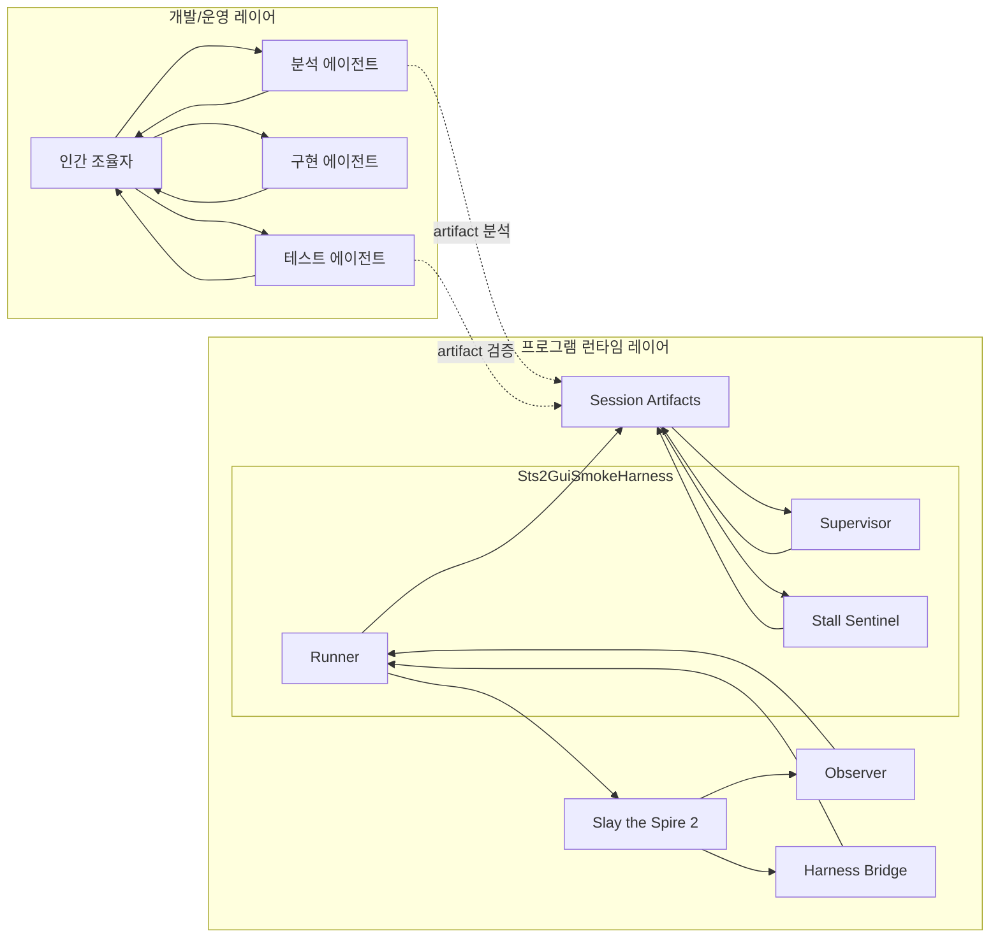
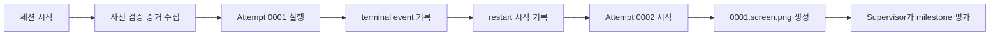
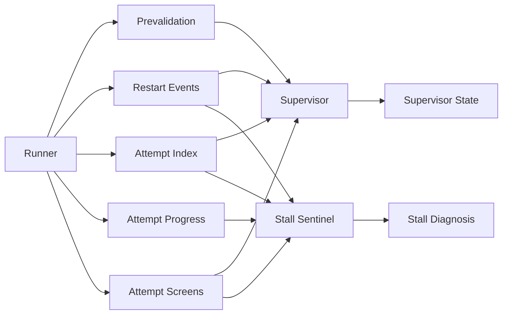
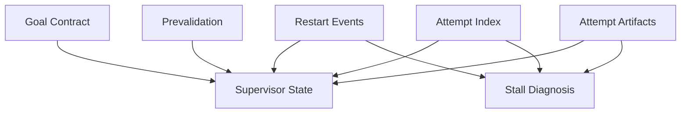
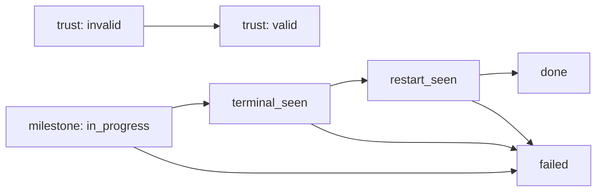
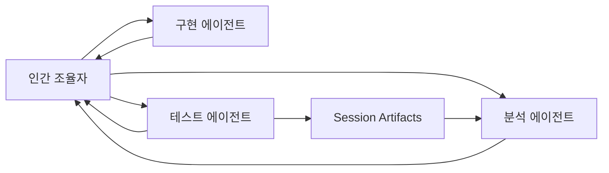

# Runner Supervisor Agent Architecture

> Status: Live Contract
> Source of truth: Yes
> Update when: chronology/projection semantics, attempt/session accounting, or supervisor contract changes.

## 0. 먼저 읽을 요약

이 문서는 두 가지를 분리해서 설명한다.

1. 지금 실제로 개발 중인 하네스 프로그램 구조
2. 그 하네스를 개발하고 검증하기 위해 사람이 어떻게 AI 에이전트를 분업해서 쓰는가

가장 중요한 요점만 먼저 적으면 다음과 같다.

- 이 프로젝트의 현재 핵심 시스템은 `Sts2GuiSmokeHarness` long-run 하네스다.
- 이 하네스는 게임을 실제로 진행하는 개발용 black-box tester다.
- 행동 결정의 1차 기준은 여전히 `screenshot-first`다.
- observer/export는 아직 최종 결정권은 아니지만, 후보 생성과 검증 입력으로 점진 승격 중이다.
- long-run에서 `완료`는 "게임이 잘 끝났다"가 아니라 "신뢰 가능한 restart progression 증거가 artifact로 닫혔다"를 뜻한다.
- `restart-events.ndjson`는 chronology source로, `attempt-index.ndjson` / `session-summary.json` / `supervisor-state.json`는 projection으로 읽는 것이 현재 현실과 가장 잘 맞는다.
- quartet semantics는 `restart-events = chronology`, `attempt-index = terminal projection`, `session-summary = reviewer projection`, `supervisor-state = machine verdict projection`으로 읽는다.
- bootstrap은 attempt가 아니라 session-level pre-attempt phase로 읽는다.
- `runner / supervisor / stall sentinel`은 프로그램의 런타임 역할이다.
- `인간 조율자 / 분석 에이전트 / 구현 에이전트 / 테스트 에이전트`는 개발/운영 역할이다.
- 이 둘을 섞으면 문서도 어려워지고, 실제 운영 판단도 흐려진다.

## 0-1. 현재 상태 포인터

current blocker, active milestone, latest authoritative root는 이 문서가 아니라 아래 두 문서에서 관리한다.

- 현재 상태: [PROJECT_STATUS.md](../current/PROJECT_STATUS.md)
- 다음 구현 세션 handoff: [AI_HANDOFF_PROMPT_KO.md](../current/AI_HANDOFF_PROMPT_KO.md)

이 문서는 current snapshot이 아니라 `chronology / projection / role contract`를 설명하는 문서다. 아래부터는 상태 보고보다 구조와 semantics에 집중한다.

## 0-2. Quartet Canonical Contract

authoritative attempt / session accounting은 아래 quartet로 고정한다.

1. `restart-events.ndjson`
   - 유일한 append-only chronology source
   - authoritative attempt lifecycle reconstruction의 기준
2. `attempt-index.ndjson`
   - terminal attempt summary projection
   - active attempt를 표현하려고 확장하지 않는다
3. `session-summary.json`
   - reviewer-facing projection
   - `attemptCount = authoritative attempts started`
   - `terminalAttemptCount = authoritative attempts terminaled`
   - `activeAttemptId = chronology 기준 active attempt`
4. `supervisor-state.json`
   - machine verdict projection
   - canonical field:
     - `trustState`
     - `milestoneState`
     - `sessionState`
     - `expectedCurrentAttemptId`
     - `lastTerminalAttemptId`
     - `latestRestartTargetAttemptId`
     - `latestNextAttemptId`

중요:

- `trustStateAtStart`는 계속 "attempt 시작 시점 truth"다.
- `lastAttemptId`는 canonical truth가 아니라 legacy alias다.
- 현재 구현에서는 `lastAttemptId == lastTerminalAttemptId`로만 읽어야 한다.
- current attempt 해석은 `lastAttemptId`가 아니라 `expectedCurrentAttemptId` / `activeAttemptId`로 한다.

## 1. 문서 목적

### 이 문서가 설명하는 것

- `src/Sts2GuiSmokeHarness/Program.cs`
- `src/Sts2GuiSmokeHarness/LongRunArtifacts.Supervision.cs`
- `docs/reference/harness/HARNESS_MODE.md`
- `docs/snapshots/harness/STS2_HARNESS_REVIEW.md`
- `docs/reference/harness/DECOMPILED_SOURCE_FIRST_OBSERVER_STRATEGY.md`
- `docs/runbooks/SMOKE_TEST_CHECKLIST.md`

이 문서는 위 코드와 문서를 바탕으로, 현재 long-run 하네스가 어떤 구조로 동작하는지와, 그 시스템을 개발할 때 사람이 어떤 방식으로 AI 에이전트를 분업하는지를 한 문서 안에서 정리한다.

### 이 문서의 대상 독자

- 하네스 코드를 수정하려는 개발자
- smoke artifact를 읽고 실패 원인을 정리해야 하는 사람
- orchestration, harness architecture, artifact-driven validation에 아직 익숙하지 않은 팀원

### 이 문서가 의도적으로 제외하는 것

- production advisor 전체 아키텍처
- commander의 최종 제품형 orchestration 완성 설계
- 아직 코드나 artifact 계약으로 고정되지 않은 추상적 아이디어

### 구현 상태 표기

- `이미 구현됨`: 코드와 artifact 계약으로 확인된 상태
- `부분 구현`: 방향과 일부 구현은 있으나 coverage나 운영 안정성이 제한된 상태
- `향후 과제`: 필요성과 방향은 보이지만 아직 주 경로로 고정되지 않은 상태

## 2. 이 문서를 어떻게 읽으면 좋은가

처음 읽는 사람에게는 아래 순서를 권한다.

1. `0. 먼저 읽을 요약`
2. `3. 먼저 구분해야 할 두 세계`
3. `4. 짧은 용어 사전`
4. `5. long-run 세션을 쉬운 말로 따라가기`

그 다음 필요에 따라 나눠 읽으면 된다.

- 런타임 구조가 궁금하면 `6. 현재 시스템 개요`, `7. 런타임 역할 아키텍처`, `8. 핵심 artifact 계약`, `9. 상태 모델`
- observer와 screenshot-first 관계가 궁금하면 `10. Observer / Screenshot-First / Scene Authority`
- 최근 어디서 막히는지가 궁금하면 `11. 최근 실제 병목 이동`
- 사람과 AI 에이전트 운영 구조가 궁금하면 `12. 개발/운영 에이전트 분업 구조`, `13. 현재 workflow`

## 3. 먼저 구분해야 할 두 세계

이 프로젝트를 이해하기 어렵게 만드는 첫 번째 원인은, 서로 다른 두 계층이 한 문서 안에서 같이 등장하기 때문이다.

### 세계 1. 프로그램 런타임 세계

이것은 실제 코드가 실행되는 세계다.

- `runner`
- `supervisor`
- `stall sentinel`
- observer
- harness bridge
- session artifacts

이들은 모두 프로그램의 일부이거나 프로그램이 남기는 결과물이다.

### 세계 2. 개발/운영 세계

이것은 사람이 시스템을 개발하고 검증하는 세계다.

- 인간 조율자
- 분석 에이전트
- 구현 에이전트
- 테스트 에이전트

이들은 프로그램 바깥에서 artifact를 읽고, 코드를 바꾸고, 다시 검증하는 주체다.

### 한눈에 보는 구조



읽는 법:

- 아래쪽은 프로그램이 실제로 실행되며 artifact를 만들고 판정하는 영역이다.
- 위쪽은 사람이 그 결과를 읽고 다음 수정/검증을 정하는 영역이다.
- `Runner / Supervisor / Stall Sentinel`은 프로그램 역할이다.
- `분석 / 구현 / 테스트 에이전트`는 개발 역할이다.

### 빠른 비교표

| 구분 | 한 줄 설명 | 예시 | 직접 게임 입력 여부 | 주된 산출물 |
|---|---|---|---|---|
| 프로그램 역할 | 실행 중인 시스템 내부 책임 | `runner`, `supervisor`, `stall sentinel` | `runner`와 bridge만 직접 수행 | JSON, NDJSON, PNG, log |
| 개발/운영 역할 | 시스템을 개발하고 검증하는 작업 주체 | 인간 조율자, 분석/구현/테스트 에이전트 | 직접 입력보다 분석, 수정, 검증 | 코드 패치, 문서, 검증 보고 |

## 4. 짧은 용어 사전

이 문서에서 자주 나오는 용어를 먼저 쉬운 말로 적는다.

| 용어 | 쉬운 뜻 |
|---|---|
| harness | 게임을 자동으로 돌려 보고 증거를 남기는 개발용 도구 |
| long-run session | 여러 번의 attempt를 묶어 추적하는 장기 실행 단위 |
| attempt | session 안에서의 개별 실행 1회 |
| artifact | 실행 중 남기는 파일 증거 |
| trust gate | 이 실행 결과를 믿어도 되는지 확인하는 사전 검증 문 |
| milestone | long-run이 정말 원하는 증거 체인이 닫혔는지 나타내는 단계 |
| observer | 게임 내부 상태를 밖으로 export하는 관측 계층 |
| screenshot-first | 진행 판단을 먼저 스크린샷 의미 해석에 두는 방식 |
| scene authority | "지금 정말 어떤 화면이 준비되었는가"를 권위 있게 판단하는 기준 |
| orchestration | 사람, 에이전트, 프로그램 역할을 연결해 다음 행동 순서를 정하는 것 |
| stall | 하네스가 더 진행하지 못하고 같은 상태에 머무는 문제 |

이 문서에서 가장 많이 헷갈리는 쌍은 아래 둘이다.

- `trust`와 `success`
- `프로그램 역할`과 `개발 역할`

`trust`는 "믿을 수 있나"이고, `success`는 "무언가 진행된 것처럼 보이나"다. 둘은 다르다.

## 5. long-run 세션을 쉬운 말로 따라가기

이 문서를 가장 쉽게 이해하는 방법은 추상 용어 대신, 세션 하나가 실제로 어떻게 굴러가는지를 순서대로 보는 것이다.

### 쉬운 설명

1. runner가 session 폴더를 만든다.
2. deploy와 clean boot가 제대로 되었는지 증거를 모은다.
3. fresh root면 먼저 bootstrap launch를 실행해 manual clean boot와 runtime-started evidence를 pre-attempt phase에서 확인한다.
4. bootstrap이 성공하면 게임을 다시 relaunch하고, 그 다음부터 `attempt 0001`을 authoritative attempt로 연다.
5. 매 step마다 스크린샷과 observer 복사본, progress 로그를 남긴다.
6. attempt가 끝나면 terminal event를 기록한다.
7. runner가 다음 attempt를 다시 시작하려고 하면 restart event를 기록한다.
8. `attempt 0002`의 첫 스크린샷이 실제로 생기면 restart progression 증거 체인이 닫힌다.
9. 이때 trust gate까지 valid였다면 supervisor는 long-run milestone을 `done`으로 올릴 수 있다.

### 그림으로 보기



### 왜 이렇게까지 file evidence를 요구하는가

사람이 눈으로 볼 때는 "다시 시작된 것 같다"라고 느낄 수 있다. 하지만 long-run 문서의 기준은 느낌이 아니라 파일 증거다. 이유는 다음과 같다.

- deploy가 stale일 수 있다.
- harness contamination이 있을 수 있다.
- observer snapshot이 순간적으로 틀릴 수 있다.
- commentary는 나중에 검증 근거로 쓰기 어렵다.

그래서 현재 시스템은 `보인다`보다 `남았다`를 더 믿는다.

## 6. 현재 시스템 개요

### 하네스가 현재 하는 일

상태:
- `이미 구현됨`

현재 하네스의 핵심 목적은 사람 대신 게임을 실제로 플레이하면서, observer와 runtime layer를 검증할 수 있는 고품질 실행 증거를 만드는 것이다.

이 시스템은 다음 두 가지를 동시에 추구한다.

1. 게임을 실제로 진행하는 것
2. 그 진행을 나중에 검증할 수 있게 evidence로 남기는 것

최신 상태를 반영하면, observer/export의 위치는 "그저 사후 로그"보다 조금 더 올라와 있다. 다만 아직도 최종 행동 결정의 권위는 아니다. 현재 observer/export는 다음 용도로 점진 승격 중이다.

- screenshot-first가 고른 후보를 보강하거나 좁히는 입력
- mixed-state에서 foreground/background를 구분하는 힌트
- post-click recapture와 loop diagnosis의 검증 입력

### `boot-to-long-run`이란 무엇인가

상태:
- `이미 구현됨`

`boot-to-combat`이 짧은 smoke path라면, `boot-to-long-run`은 restart progression까지 포함해 세션 전체를 평가하는 경로다. 핵심은 한 번의 attempt 성공이 아니라, session 차원에서 "terminal 이후 next attempt가 실제로 이어졌는가"를 닫는 것이다.

### 왜 durable artifact 기반 completion이 필요한가

상태:
- `이미 구현됨`

long-run에서는 아래 세 가지가 동시에 필요하다.

- `신뢰성`: stale deploy나 contamination이 아닌가
- `완료성`: terminal 이후 다음 시도가 실제 시작되었는가
- `진단 가능성`: 나중에 실패 원인을 다시 읽을 수 있는가

이 때문에 `done`을 단순한 성공 신호가 아니라 artifact 체인으로 정의한다.

### 현재 런타임 상태를 쉬운 말로 요약하면

상태:
- `이미 구현됨`

- screenshot-first 방향은 유지되고 있다.
- observer/export는 최종 권한은 아니지만 candidate generation과 validation input으로 점진 승격 중이다.
- combat은 이전보다 훨씬 덜 "고정 좌표 감"에 의존한다.
- reward-map recovery는 실제 전진했고, reward와 map을 동시에 보는 layered state가 생겼다.
- 최신 blocker는 "event choice를 못 읽는 문제"보다 "event foreground 위에 섞여 보이는 map overlay와 current-node arrow를 잘못 모델링하는 문제"다.

## 7. 런타임 역할 아키텍처

### 먼저 쉬운 비유로 보기

- `Runner`: 실제로 게임을 만지는 실행자
- `Supervisor`: "이 세션 결과를 믿어도 되는가"를 판정하는 심판
- `Stall Sentinel`: "왜 막혔는가"를 분류하는 진단자

### 중요한 전제

상태:
- `이미 구현됨`

현재 `runner / supervisor / stall sentinel`은 논리 역할로는 분리되어 있지만, 물리적으로는 상주 프로세스 3개가 따로 도는 구조가 아니다. `runner`는 `Sts2GuiSmokeHarness`의 실제 실행 주체이고, `supervisor`와 `stall sentinel`은 `LongRunArtifacts` 내부에서 artifact를 다시 계산하는 판정 역할로 구현되어 있다.

즉 현재 구조는 "역할 분리"는 되어 있지만 "프로세스 분리"까지는 아직 아니다.

### 런타임 역할 흐름도



읽는 법:

- `Runner`가 실제 실행과 1차 artifact 생성을 맡는다.
- `Supervisor`는 trust, milestone, health를 평가한다.
- `Stall Sentinel`은 stall 유형을 분류한다.
- `Prevalidation`은 `prevalidation.json`을, `Restart Events`는 `restart-events.ndjson`을, `Attempt Progress`는 `attempts/*/progress.ndjson`을, `Attempt Screens`는 `attempts/*/steps/*.screen.png`를 뜻한다.

### 역할별 상세

#### Runner

상태:
- `이미 구현됨`

중심 구현:
- `src/Sts2GuiSmokeHarness/Program.cs`

| 항목 | 내용 |
|---|---|
| 책임 | session 생성, deploy/clean boot evidence 기록, 게임 launch, screenshot capture, observer read, decision 실행, attempt terminal 기록, restart 시작 기록 |
| 금지된 행동 | trust gate 미충족 상태를 성공으로 간주, commentary만으로 done 판정, supervisor 역할 흉내 내기 |
| 읽는 artifact | live export snapshot, harness queue/status/inventory, 기존 session 계약 파일 |
| 쓰는 artifact | `goal-contract.json`, `prevalidation.json`, `restart-events.ndjson`, `attempt-index.ndjson`, `session-summary.json`, `progress.ndjson`, `steps/*.screen.png` 등 |
| 다른 역할과의 경계 | 실행 owner는 runner 하나뿐이다. attempt를 실제로 만들고 게임을 움직이는 주체도 runner뿐이다. |
| 실제 코드 반영 상태 | `이미 구현됨` |

#### Supervisor

상태:
- `이미 구현됨`

중심 구현:
- `src/Sts2GuiSmokeHarness/LongRunArtifacts.Supervision.cs`

| 항목 | 내용 |
|---|---|
| 책임 | trust gate 계산, milestone 계산, session health 계산, blocker/evidence 정리 |
| 금지된 행동 | 게임 kill, relaunch, deploy, attempt 생성, 직접 행동 명령 발행 |
| 읽는 artifact | `goal-contract.json`, `prevalidation.json`, `restart-events.ndjson`, `attempt-index.ndjson`, `session-summary.json`, `steps/*.screen.png` |
| 쓰는 artifact | `supervisor-state.json`, 갱신된 `goal-contract.json` |
| 다른 역할과의 경계 | read-mostly, decision-only 역할이다. 실행자가 아니다. |
| 실제 코드 반영 상태 | `이미 구현됨`, 다만 독립 상주 프로세스는 아님 |

#### Stall Sentinel

상태:
- `이미 구현됨`

중심 구현:
- `src/Sts2GuiSmokeHarness/LongRunArtifacts.Supervision.cs`

| 항목 | 내용 |
|---|---|
| 책임 | stall 유형 분류, phase mismatch/overlay loop/wait plateau 같은 병목 진단 |
| 금지된 행동 | recovery action 실행, attempt kill/restart, deploy/launch 대행 |
| 읽는 artifact | `attempt-index.ndjson`, `restart-events.ndjson`, `progress.ndjson`, `failure-summary.json`, `self-meta-review.json`, `steps/*.screen.png` |
| 쓰는 artifact | `stall-diagnosis.ndjson` |
| 다른 역할과의 경계 | diagnosis-only다. 실행을 대신하지 않는다. |
| 실제 코드 반영 상태 | `이미 구현됨` |

## 8. 핵심 artifact 계약

### 먼저: artifact란 무엇인가

이 문서에서 artifact는 "하네스가 실행 중 남기는 파일 증거"를 뜻한다. 나중에 trust, done, stall, health를 판정할 때 말이 아니라 이 파일들을 본다.

### Session Root 구조

상태:
- `이미 구현됨`

```text
artifacts/gui-smoke/<session-id>/
  goal-contract.json
  prevalidation.json
  restart-events.ndjson
  attempt-index.ndjson
  supervisor-state.json
  stall-diagnosis.ndjson
  session-summary.json
  meta-reviews.ndjson
  scene-recipes.ndjson
  unknown-scenes.ndjson
  attempts/
    0001/
      run.json
      run.log
      trace.ndjson
      progress.ndjson
      failure-summary.json
      validation-summary.json
      self-meta-review.json
      steps/
        0001.screen.png
        0001.observer.state.json
```

읽는 법:

- session root는 세션 전체 판정에 쓰는 상위 증거 위치다.
- `attempts/<id>/`는 각 attempt의 원시 증거 위치다.

### Artifact 관계도



읽는 법:

- supervisor는 세션 계약과 attempt 증거를 합쳐 `supervisor-state.json`을 만든다.
- stall sentinel은 진행 흔적을 합쳐 `stall-diagnosis.ndjson`을 만든다.
- `Attempt Artifacts`는 `run.log`, `progress.ndjson`, `steps/*.screen.png` 등을 묶어 부르는 말이다.
- startup diagnostics는 `startup-trace.ndjson`과 `startup-summary.json`으로 별도 분리되어, gameplay loop 이전의 boot/deploy/first-step 실패를 따로 읽게 해 준다.

### Artifact별 상세

| Artifact | 쉬운 의미 | 누가 쓴다 | 누가 읽는다 | 어떤 판정에 쓰이나 | 현재 알려진 한계 | 상태 |
|---|---|---|---|---|---|---|
| `goal-contract.json` | 이 세션의 상위 계약서 | runner, supervisor | runner, supervisor, `inspect-session` | `trustState`, `milestoneState`, `sessionState`, completion criteria | 단일 runner owner 중심, 다중 orchestrator 경쟁 미고려 | `이미 구현됨` |
| `prevalidation.json` | 이 세션이 믿을 만한 준비 상태였는지 기록 | runner | supervisor, `inspect-session` | trust gate 계산 | 외부 수동 조작 누락 시 invalid가 남을 수 있음 | `이미 구현됨` |
| `startup-trace.ndjson` | deploy, launch, first-step startup 경로를 단계별로 남긴 trace | runner | 인간 조율자, 테스트 에이전트, 분석 에이전트 | startup failure triage, clean boot gate miss, deploy/launch 경계 판독 | gameplay 중 mixed-state 자체를 설명해 주지는 않음 | `이미 구현됨` |
| `startup-summary.json` | startup trace를 요약한 부트 진단 스냅샷 | runner | 인간 조율자, 테스트 에이전트 | startup path 요약, 빠른 실패 분류 | 세부 클릭/화면 루프까지 대체하지는 못함 | `이미 구현됨` |
| `restart-events.ndjson` | authoritative attempt lifecycle를 append-only로 남긴 순서 이벤트 기록 | runner | supervisor, stall sentinel, 인간 조율자 | restart progression 증거 체인, chronology reconstruction | bootstrap pre-phase는 여기서 세지지 않음 | `이미 구현됨` |
| `attempt-index.ndjson` | terminal된 authoritative attempt의 요약 projection | runner | supervisor, stall sentinel, 분석자 | terminal cause, failure class, trustStateAtStart 분류 | chronology source가 아니라 summary projection이다 | `이미 구현됨` |
| `supervisor-state.json` | trust/milestone/health와 current/terminal attempt 해석 결과 | supervisor | runner, 인간 조율자, 테스트 에이전트 | machine verdict, blocker/evidence 확인 | chronology 자체가 아니라 projection이다 | `이미 구현됨` |
| `stall-diagnosis.ndjson` | 왜 막혔는지 분류한 진단 결과 | stall sentinel | 분석 에이전트, 인간 조율자, 구현 에이전트 | 병목 유형 라우팅 | 직접 recovery를 수행하지 않음 | `이미 구현됨` |
| `progress.ndjson` | step별 진행 요약 | runner | stall sentinel, self meta review, 분석자 | plateau, same-action-stall, overlay loop 해석 | raw screenshot 없이 보면 과잉 해석 위험 | `이미 구현됨` |
| `run.log` | 사람이 읽기 쉬운 실행 로그 | runner | 인간 조율자, 분석/테스트 에이전트 | 보조 해석 | 권위 있는 증거는 아님 | `이미 구현됨` |
| `steps/*.screen.png` | 각 step의 실제 화면 증거 | runner | runner, 분석/테스트 에이전트, supervisor | next attempt first-screen proof, screenshot-first 판단 | scene authority를 이것만으로 완전히 닫을 수는 없음 | `이미 구현됨` |
| `session root / attempts/<id>/` | 세션 전체 증거와 개별 실행 증거를 분리한 폴더 구조 | runner | supervisor, sentinel, 분석자 | 세션 vs attempt 경계 유지 | 현재는 파일 시스템 계약 중심 | `이미 구현됨` |

### Chronology vs Projection Contract

현재 fresh roots를 가장 잘 설명하는 계약은 아래다.

- `restart-events.ndjson`
  - authoritative attempt/session chronology의 canonical source
  - `runner-launch-issued -> next-attempt-started -> attempt-terminal -> runner-begin-restart` 순서를 가장 직접적으로 보여 준다
- `attempt-index.ndjson`
  - terminal된 authoritative attempt 요약 projection
  - chronology를 재구성하는 원시 source로 읽지 않는다
- `session-summary.json`
  - reviewer-facing aggregate projection
  - `attemptCount`, `terminalAttemptCount`, `activeAttemptId` 같은 빠른 요약을 제공하지만 chronology를 대체하지 않는다
- `supervisor-state.json`
  - machine verdict projection
  - `trustState`, `milestoneState`, `sessionState`, blocker/evidence를 읽는 파일이지 append-only event stream이 아니다

현재 human reviewer가 우선 읽어야 할 field는 다음 쪽이다.

- `expectedCurrentAttemptId`
- `lastTerminalAttemptId`
- `latestRestartTargetAttemptId`
- `latestNextAttemptId`

반대로 `lastAttemptId`는 아직 wire shape는 유지하지만, current attempt와 terminal attempt를 동시에 암시할 수 있는 legacy/ambiguous field로 취급하는 편이 안전하다.

## 9. 상태 모델

### 먼저: 이 네 상태는 서로 다른 질문에 답한다

| 상태 | 답하는 질문 |
|---|---|
| `trustState` | 이 세션 결과를 믿어도 되는가 |
| `milestoneState` | long-run이 원하는 증거 체인이 닫혔는가 |
| `sessionState` | runner가 지금 세션을 어떤 lifecycle 상태로 보고 있는가 |
| `healthState` | 현재 실행이 건강한가, 경고 상태인가, 위기인가 |

이 네 가지를 한 덩어리로 읽으면 문서가 어렵다. 각자 다른 질문에 답한다고 생각하면 훨씬 쉽다.

### 상태 전이 요약



요약:

- trust는 사전 검증 gate가 닫혔는지로 정해진다.
- milestone은 terminal -> restart -> next attempt first screen 증거 체인으로 정해진다.

### `trustState`

상태:
- `이미 구현됨`

값:
- `invalid`
- `valid`

전이 조건:
- `prevalidation.json`의 네 gate가 모두 참이면 `valid`
- 하나라도 빠지면 `invalid`

핵심 의미:
- gameplay 결과를 믿을 수 있는지 여부다.
- "뭔가 진행된 것 같다"와 "신뢰할 수 있다"는 다르다.

`trust invalid`일 때 금지되는 것:

- `milestone done`을 신뢰하는 것
- gameplay 결과를 정상 기준으로 디버깅하는 것
- false success 보고

### `milestoneState`

상태:
- `이미 구현됨`

값:
- `in_progress`
- `terminal_seen`
- `restart_seen`
- `done`
- `failed`

전이 조건:

- trusted attempt의 terminal 기록이 있으면 `terminal_seen`
- 그 뒤 `runner-begin-restart`가 있으면 `restart_seen`
- 같은 restart target attempt의 `next-attempt-started`와 `steps/0001.screen.png`가 있으면 `done`
- 세션이 abort되었는데 이 증거 체인이 끝까지 닫히지 않으면 `failed`

핵심 포인트:

- "attempt 하나가 끝났다"만으로 `done`이 아니다.
- "restart를 시작했다"만으로도 `done`이 아니다.
- 다음 attempt의 첫 화면 증거가 실제로 있어야 `done`이다.

### `sessionState`

상태:
- `이미 구현됨`

값:
- `starting`
- `collecting`
- `stalled`
- `aborted`
- `completed`

전이 조건:

- session 초기화 시 `starting`
- runner가 attempt를 수집 중이면 `collecting`
- terminal 이후 restart 판단 전 중간 상태를 남길 때 `stalled`
- 연속 launch failure, 연속 scene dead-end, milestone 미완료 종료 시 `aborted`
- milestone done 이후 runner 종료 시 `completed`

### `healthState`

상태:
- `이미 구현됨`

값:
- `healthy`
- `warning`
- `critical`

health classifications:

- `runner-dead`
- `no-artifact-heartbeat`
- `window-detected-no-step`

전이 근거:

- active session인데 runner owner가 죽었으면 `critical`
- active session인데 최근 artifact heartbeat가 없으면 `warning`
- 창은 있는데 current attempt 첫 step screenshot이 안 생기면 `warning`

현재 한계:

- health는 프로세스/파일 heartbeat 중심이다.
- semantic deadlock은 stall diagnosis를 같이 봐야 한다.

### Stall Diagnoses

상태:
- `이미 구현됨`

대표 분류:

- `phase-mismatch-stall`
- `decision-wait-plateau`
- `inspect-overlay-loop`
- `same-action-stall`
- `scene-authority-invalid`
- `phase-timeout`
- `decision-abort`
- `launch-runtime-noise`

쉽게 말하면:

- `phase-mismatch-stall`: 코드상 phase와 실제 화면이 어긋남
- `decision-wait-plateau`: 계속 기다리기만 하며 진전이 없음
- `inspect-overlay-loop`: overlay를 닫는 행동만 반복함
- `same-action-stall`: 같은 행동을 반복함

## 10. Observer / Screenshot-First / Scene Authority

### 가장 쉬운 설명

현재 하네스는 아래처럼 생각하면 된다.

- 행동은 먼저 스크린샷을 보고 정한다.
- observer/export는 내부 상태와 로그를 export하고, 점점 더 후보 생성과 검증 입력으로도 쓰인다.
- scene authority는 decompiled flow와 runtime confirmation으로 보강한다.

즉 현재 역할 분담은 아래에 가깝다.

- `스크린샷`은 진행의 1차 기준
- `observer/export`는 후보 생성, foreground 판별 보조, 사후 검증의 기준
- `decompiled source`는 scene authority를 강화하는 기준

### 왜 observer를 action authority로 두지 않는가

상태:
- `이미 구현됨`

최근 문서와 코드가 공통으로 말하는 것은 다음이다.

- smoke harness는 black-box tester다.
- observer가 틀려도 harness는 계속 진행할 수 있어야 한다.
- mixed room states에서는 observer stale branch가 실제 진행을 오도할 수 있다.

그래서 현재는 `observer가 무엇이라고 말하나`보다 `스크린샷이 실제로 무엇을 보여 주나`가 우선이다.

다만 최신 상태를 반영하면 "observer는 그냥 로그일 뿐"이라고 쓰는 것도 이제는 불충분하다. 현재 observer/export는 다음 쪽으로 점진 승격 중이다.

- explicit event/reward affordance가 실제 foreground인지 확인
- reward/map layered state에서 stale reward bounds와 usable reward bounds 구분
- combat에서 current-frame enemy target node와 hitbox/body bounds 제공
- sentinel과 inspect-session 재계산의 입력

### Observer가 현재 제공하는 것

상태:
- `이미 구현됨`

- telemetry
- internal truth export
- post-run validation 근거
- event + polling mixed observer 구조
- candidate generation 보조 입력
- mixed-state validation 입력
- current-frame actionable target export

polling의 역할:

- continuous state
- reconciliation
- drift detection
- watchdog

hook/event가 더 필요한 곳:

- scene transition
- screen ready
- lifecycle boundary

### 왜 decompiled-source-first 전략이 필요한가

상태:
- `부분 구현`

scene authority는 단순히 `state.latest.json` 한 장으로 닫히지 않는다. 현재 기준은 다음과 같다.

- transient snapshot만으로 `scene-ready` 확정 금지
- 먼저 decompiled 코드에서 실제 진입/준비 완료 메서드 후보를 찾음
- 그 다음 runtime hook/event와 polling을 역할에 맞게 배치

즉 이 전략은 "polling을 버리자"가 아니라 "scene authority를 더 강한 근거로 보강하자"에 가깝다.

이 전략이 계속 필요한 이유는 최신 gameplay-side blocker의 성격 때문이다. 지금 문제의 초점은 "이벤트 옵션 텍스트를 전혀 못 읽는다"보다는, "event foreground 위에 섞여 보이는 map arrow를 foreground actionable target처럼 승격한다"로 이동했다.

### Transient vs Authoritative

| 분류 | 예시 | 왜 그렇게 보는가 |
|---|---|---|
| authoritative에 가까운 것 | `goal-contract.json`, `prevalidation.json`, `restart-events.ndjson`, `steps/*.screen.png`, decompiled-backed confirmation | 나중에 다시 읽어도 같은 chronology/판정을 재현하기 쉬움 |
| durable projection | `attempt-index.ndjson`, `session-summary.json`, `supervisor-state.json` | 유용하지만 source artifact를 요약/해석한 결과이므로 chronology source를 대체하지는 않음 |
| transient하거나 보조적인 것 | 단일 `state.latest.json`, 콘솔 commentary, 순간적인 observer choice set | 일시적이거나 재검증 근거로 약함 |

## 11. 최근 실제 병목 이동

이 섹션은 "예전에 어디가 문제였고, gameplay-side에서는 어디가 더 큰 병목이었는가"를 보여 주기 위한 진단 섹션이다.

중요:

- 이 섹션은 현재 overall milestone blocker를 직접 말하는 부분이 아니다.
- current blocker와 milestone pointer는 [PROJECT_STATUS.md](../current/PROJECT_STATUS.md)에서 본다.
- 아래 표는 gameplay-side historical movement를 읽는 용도로만 봐야 한다.

### 병목 이동 타임라인

| 단계 | 무엇을 막았나 | 무엇을 바꿨나 | 그 결과 새로 드러난 병목 | 상태 |
|---|---|---|---|---|
| 1 | false done | `done`을 terminal 하나가 아니라 `terminal -> restart -> next attempt first screen` 체인으로 강화 | 완료 판정은 더 정확해졌지만 조건이 복잡해짐 | `이미 구현됨` |
| 2 | trust gate self-invalidation 누락 | `prevalidation.json`과 trust gate를 전면화 | gameplay가 진행돼도 invalid trust일 수 있다는 점이 더 중요해짐 | `이미 구현됨` |
| 3 | Manual Clean Boot gate miss | first step, main menu, arm clear, actions clear, harness dormant를 검증 | contamination 차단은 강해졌지만 사전 준비 중요도가 커짐 | `이미 구현됨` |
| 4 | combat enemy-targeting이 fixed anchor에 너무 의존함 | live hitbox/export 기반 enemy target node를 도입하고 combat noop loop 진단을 강화 | combat은 전진했고, 병목이 mixed-state 쪽으로 더 선명해짐 | `이미 구현됨` |
| 5 | reward/map oscillation | reward/map layered state, reward back, recovery window를 도입 | reward-map recovery는 전진했지만 event 뒤 overlay mixed-state가 새 blocker로 부상 | `부분 구현` |
| 6 | `Embark + event + wait` phase mismatch | repeated wait를 `phase-mismatch-stall`로 별도 진단 | scene phase와 실제 room state 어긋남을 더 빨리 잡게 됨 | `이미 구현됨` |
| 7 | event/reward 내부 substate misroute | colorless reward, reward choice, inspect overlay, reward foreground authority를 분리 | 이제 문제의 중심이 "event choice를 못 읽음"보다 map contamination 모델링으로 이동 | `부분 구현` |
| 8 | event 뒤 map overlay mixed-state | latest-state sentinel, inspect-session 재계산, `map-transition-stall` 분류를 보강 | current-node arrow를 reachable next node처럼 오인하는 최신 blocker가 남음 | `부분 구현` |

### 현재 시점의 진단

이미 많이 해결된 것:

- false done 방지
- trust gate와 manual clean boot 전면화
- combat truth 안정화
- `combat -> rewards` 전이 확인
- inspect overlay loop 분류
- combat enemy-targeting의 live hitbox/export 기반 개선
- reward/map layered state와 recovery window 도입

아직 자주 막히는 것:

- `event 뒤 map overlay mixed-state`
- event foreground 위의 map contamination 모델링
- current-node arrow를 reachable next node처럼 오인하는 문제
- mixed-state에서의 loop terminalization
- reward back / claimable reward extractor 약점

즉 최신 병목은 "event choice를 못 읽는다"라기보다, "foreground가 event인데 background map overlay와 current-node arrow를 잘못 행동 목표로 승격한다"에 더 가깝다.

### Combat 쪽 최신 개선

상태:
- `이미 구현됨`

combat 쪽에서 가장 큰 변화는 enemy-targeting이 예전의 fixed normalized anchor 중심에서 현재 프레임의 live hitbox/export 기반으로 옮겨왔다는 점이다.

현재 문서화해야 할 핵심 변화는 다음과 같다.

- current-frame enemy target node를 우선 사용한다.
- hitbox/body bounds가 있으면 그 좌표를 기반으로 타깃을 만든다.
- old fixed anchor는 fallback에 더 가깝다.
- `combat-noop-loop` 진단이 강화되어, 같은 막힌 lane과 enemy target 반복을 더 빨리 터미널라이즈한다.

즉 combat은 아직 완전히 끝난 문제가 아니지만, 지금의 중심 병목은 더 이상 "적을 어디 찍어야 할지 전혀 모른다"가 아니다.

### Reward/Map에서 Event/Map Overlay로 이동한 최신 blocker

상태:
- `부분 구현`

reward-map recovery는 실제로 전진했다. 구체적으로는 아래가 들어왔다.

- reward/map layered state
- reward foreground authority
- reward back navigation
- short recovery window

하지만 최신 blocker는 reward/map 자체보다 더 앞선 `event 뒤 map overlay mixed-state` 쪽이다. 현재 문제를 가장 정확히 표현하면 아래와 같다.

- 핵심 문제는 "event choice 텍스트를 못 읽음"이 아니다.
- 핵심 문제는 "event foreground 위에 섞여 있는 map overlay를 잘못 foreground actionable target처럼 모델링함"이다.
- 특히 current-node arrow를 reachable next node처럼 오인하는 것이 최신 오류 축이다.

즉 지금 필요한 것은 event 옵션 OCR을 더 늘리는 것보다, foreground/background와 contamination 모델을 더 정확히 나누는 일이다.

## 12. 개발/운영 에이전트 분업 구조

이 절은 프로그램 런타임 구조가 아니라, 그 구조를 개발하는 작업 방식에 대한 설명이다.

### 개발/운영 handoff 흐름도



읽는 법:

- 분석 에이전트는 artifact를 읽어 실패를 구조화한다.
- 구현 에이전트는 코드를 바꾼다.
- 테스트 에이전트는 새로운 artifact를 생성한다.
- 인간 조율자는 이 사이의 우선순위와 handoff 품질을 책임진다.

### 역할별 설명

| 역할 | 목표 | 입력 | 출력 | handoff 시 필요한 정보 | 하면 안 되는 것 | 왜 필요한가 |
|---|---|---|---|---|---|---|
| 인간 조율자 | 전체 우선순위 결정, false success 차단 | `supervisor-state.json`, `stall-diagnosis.ndjson`, 주요 screenshot, run.log | 다음 작업 단위, handoff prompt, 종료 기준 | 실패 유형, authoritative artifact 경로, 현재 구현 상태 | artifact 확인 없이 성급히 결론 내리기 | 현재는 문맥 통합과 최종 판단이 아직 인간에게 가장 안전함 |
| 분석 에이전트 | 실패 구조화, root cause 후보 정리 | supervisor/stall diagnosis, progress, screenshots, 관련 문서 | failure narrative, 수정 대상 코드 영역 | 확정 사실과 가설 구분, authoritative evidence | 추측으로 코드 변경 방향 확정 | mixed artifact를 먼저 분해해야 구현이 헛돌지 않음 |
| 구현 에이전트 | 국소 코드 수정, 불변식 유지 | 분석 결과, 관련 코드, guardrail | 코드 패치, self-test 보강, 용어 정리 | 무엇을 바꿨는지, 어떤 failure class를 줄이려는지 | 증거 없는 대규모 리팩터링, trust gate 우회 | 현재 병목은 작은 정확도 개선의 누적임 |
| 테스트 에이전트 | 수정이 실제 artifact 기준으로 개선됐는지 확인 | 빌드 산출물, 시나리오, 비교 기준 | trust-aware 검증 결과, 새 artifact | 실행 조건, 세션 경로, regressions | stale deploy를 정상 검증으로 보고 | 이 시스템은 "실행"과 "신뢰 가능한 실행"이 다름 |

### 왜 인간이 아직 최종 orchestration을 맡는가

상태:
- `이미 운영 중`

현재는 완전 자동 orchestrator보다 인간 조율이 더 적절하다. 이유는 다음과 같다.

- trust gate, deploy identity, manual clean boot, runtime contamination이 동시에 얽힌다.
- 최근 병목 이동 문맥까지 알아야 올바른 우선순위를 정할 수 있다.
- 잘못된 artifact를 믿으면 false success를 대량 생산할 수 있다.

즉 지금 단계의 현실적인 구조는 `인간 조율 + 표준 handoff + artifact 중심 검증`이다.

## 13. 현재 workflow

### 실제 운영 흐름

1. 분석 에이전트가 실패 artifact를 읽고 구조화한다.
2. 구현 에이전트가 관련 코드를 수정하고 필요한 self-test나 replay fixture를 보강한다.
3. 테스트 에이전트가 `replay-step`, `replay-test`, 새 smoke session, `inspect-session` 재계산으로 artifact를 다시 만든다.
4. 인간 조율자가 결과를 읽고 다음 병목과 다음 담당자를 정한다.

### 이 workflow의 장점

- 실패 유형이 섞이지 않는다.
- 책임 충돌이 줄어든다.
- false success를 artifact 기준으로 걸러낼 수 있다.

### 이 workflow의 한계

- 인간 병목이 크다.
- handoff 비용이 있다.
- runtime 역할과 개발 역할을 혼동하기 쉽다.
- artifact를 읽는 데 익숙해지기까지 시간이 든다.

### 특히 자주 생기는 혼동

- `runner`가 restart를 했다는 것과 `테스트 에이전트`가 검증을 끝냈다는 것은 같은 완료가 아니다.
- `supervisor-state.json`의 판정과 `분석 에이전트`의 해석은 같은 권위 수준이 아니다.
- `stall sentinel`의 diagnosis와 `인간 조율자`의 우선순위 결정은 같은 책임이 아니다.

보고서나 handoff에서 가장 먼저 구분해야 하는 말은 이것이다.

- "이것은 프로그램이 남긴 판정인가?"
- "아니면 개발 주체가 해석한 설명인가?"

최신 운영 메모:

- `inspect-session`의 latest-state sentinel/재계산 품질은 좋아졌다.
- `replay-step`과 `replay-test` 덕분에 mixed-state 후보 선택 회귀를 live run 전에 오프라인으로 먼저 걸러낼 수 있다.
- `startup-trace.ndjson`과 `startup-summary.json`은 gameplay loop 이전의 boot/deploy/launch 실패를 분리해서 읽게 해 준다.
- 다만 mixed-state가 섞인 세션에서는 latest-state 하나만 믿지 말고, `progress.ndjson`, `stall-diagnosis.ndjson`, `steps/*.screen.png`를 함께 봐야 한다.

## 14. 앞으로의 확장 방향

| 주제 | 왜 필요한가 | 현재 상태 |
|---|---|---|
| supervisor/sentinel 상주 프로세스화 | 판정 계층을 실행 계층과 fault domain 측면에서 더 분리하기 위해 | `향후 과제` |
| AI-first fallback lane | hardcoded rule이 약한 novel screen에서 행동 후보를 더 유연하게 만들기 위해 | `향후 과제` |
| 자유 추론 vs 하드코딩 균형 | 모든 mixed-state를 규칙만으로 닫기 어렵기 때문 | `부분 구현` |
| 경량 orchestration layer | 인간 조율자의 반복 handoff를 조금 더 구조화하기 위해 | `향후 과제` |
| stale companion cleanup rule 강화 | stale deploy와 잔존 DLL/config 문제를 더 일찍 막기 위해 | `부분 구현` |
| reward back / claimable reward extractor 보강 | layered reward/map recovery의 남은 약점을 줄이기 위해 | `부분 구현` |
| event/map overlay foreground model 강화 | current-node arrow contamination을 actionable reachable node와 구분하기 위해 | `부분 구현` |
| mixed-state loop terminalization 보강 | sentinel과 inspect-session이 mixed-state loop를 더 빨리 끝낼 수 있게 하기 위해 | `부분 구현` |

## 15. 결론

현재 아키텍처의 강점은 분명하다.

- trust, milestone, session, health를 분리해서 본다.
- long-run completion을 durable artifact 체인으로 정의한다.
- 프로그램 역할과 개발 역할을 문서상으로도 분리한다.

현재 취약점도 분명하다.

- screenshot-first routing은 room substate와 mixed-state에서 계속 새로운 병목을 드러낸다.
- supervisor와 stall sentinel은 아직 논리 역할 분리가 중심이지, 물리 프로세스 분리까지 닫힌 것은 아니다.
- 완전 자동 orchestration을 지금 당장 신뢰하기에는 운영 문맥 의존성이 아직 크다.
- reward back / claimable reward extractor와 event/map overlay foreground 모델은 아직 더 강해져야 한다.

지금 시점에서 가장 중요한 설계 원칙은 아래 한 줄로 요약된다.

`신뢰와 완료는 artifact로 증명하고, 진행은 screenshot-first로 유지하되, observer/export는 후보 생성과 검증 입력으로 점진 승격한다.`
