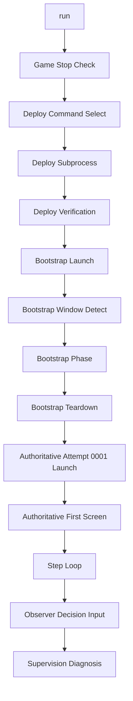

# Startup/Deploy Control Layer

> Status: Live Contract
> Source of truth: Yes
> Update when: startup/deploy/bootstrap sequencing, authoritative sources, or trust gates change.

## 1. 문서 목적

이 문서는 `Sts2GuiSmokeHarness`의 `run` 경로 안에서, startup/deploy 제어층이 실제로 어떤 순서로 동작하는지 설명한다.

특히 아래 흐름을 코드와 artifact 기준으로 정리한다.

1. `run`
2. 게임 종료 확인
3. deploy command 선택
4. deploy subprocess 실행
5. deploy verification
6. bootstrap launch
7. bootstrap window detect
8. bootstrap phase
9. bootstrap teardown
10. authoritative attempt `0001` launch
11. authoritative first screen
12. step loop
13. observer + decision + input
14. supervision/diagnosis 기록

중요:

- 이 문서는 `startup/deploy 제어층`에 집중한다.
- reward/event/combat 의사결정 규칙 자체를 전부 설명하는 문서는 아니다.
- authoritative source는 current runner / startup / artifact owner files다.
  - [Program.Runner.cs](../../src/Sts2GuiSmokeHarness/Program.Runner.cs)
  - [Program.Runner.Bootstrap.cs](../../src/Sts2GuiSmokeHarness/Program.Runner.Bootstrap.cs)
  - [Program.Runner.Deploy.cs](../../src/Sts2GuiSmokeHarness/Program.Runner.Deploy.cs)
  - [LongRunArtifacts.Startup.cs](../../src/Sts2GuiSmokeHarness/LongRunArtifacts.Startup.cs)
  - [LongRunArtifacts.Supervision.cs](../../src/Sts2GuiSmokeHarness/LongRunArtifacts.Supervision.cs)

## 2. 한눈에 보는 구조



이 흐름에서 역할을 나누면 다음과 같다.

- `runner`는 실제 실행 순서를 진행한다.
- `startup trace / prevalidation`은 startup/deploy의 증거를 남긴다.
- `supervisor`는 trust/milestone/health를 재계산한다.
- `stall sentinel`은 step loop 이후 누적된 시도를 보고 stall 분류를 쓴다.

즉 `supervisor`와 `stall sentinel`은 deploy subprocess를 직접 제어하지 않는다. 제어는 runner가 하고, 둘은 artifact를 읽어 판정만 한다.

### authoritative quartet 읽는 법

- `restart-events.ndjson`는 유일한 append-only chronology source다.
- `attempt-index.ndjson`는 terminal attempt summary projection이다.
- `session-summary.json`는 reviewer-facing projection이다.
- `supervisor-state.json`는 machine verdict projection이다.

current/terminal/restart target을 읽을 때는 아래를 기준으로 본다.

- current attempt: `session-summary.activeAttemptId`, `supervisor-state.expectedCurrentAttemptId`
- last terminal attempt: `supervisor-state.lastTerminalAttemptId`
- latest restart target: `supervisor-state.latestRestartTargetAttemptId`
- latest next-attempt proof: `supervisor-state.latestNextAttemptId`

`lastAttemptId`는 legacy alias다. current attempt를 뜻하지 않으며, 현재 구현에서는 `lastTerminalAttemptId`의 alias로만 읽는다.

## 3. 왜 이 제어층이 따로 중요한가

이 계층이 중요한 이유는, gameplay가 그럴듯해 보여도 아래가 깨져 있으면 결과를 신뢰하면 안 되기 때문이다.

- 게임이 완전히 종료되지 않은 상태에서 deploy함
- 잘못된 deploy tool 또는 오래된 output으로 deploy함
- mods payload reconciliation이 깨짐
- deployed DLL identity가 source와 다름
- main menu 이전에 stale harness state가 자동 실행됨
- manual clean boot gate를 통과하지 못함

그래서 현재 long-run은 `게임 플레이 루프`보다 앞에 `startup/deploy 제어층`을 둔다.

## 4. 실제 제어 흐름

이 섹션은 사용자 관점의 14단계를 코드/artifact와 연결해서 설명한다.

| 단계 | 실제 코드 의미 | 주요 stage 또는 artifact | 실패 시 결과 |
|---|---|---|---|
| 1. `run` | `RunScenarioAsync` 진입, scenario/provider/session root 계산 | `goal-contract.json`, 세션 폴더 초기화 | long-run 초기화 실패 |
| 2. 게임 종료 확인 | deploy 전 게임이 살아 있지 않은지 확인 | `game-stopped-before-deploy`, `prevalidation.json` | deploy 전 abort |
| 3. deploy command 선택 | fast-path 또는 fallback 명령 선택 | `deploy-command-selected`, `startup-summary.json` | 잘못된 경로면 이후 deploy 실패 |
| 4. deploy subprocess 실행 | 선택된 명령으로 실제 subprocess 실행 | `deploy-command-started`, `deploy-command-finished`, `deploy-command-summary.json` | long-run abort |
| 5. deploy verification | deploy report와 실제 파일 identity 검증 | `deploy-verification-started`, `deploy-verification-finished`, `prevalidation.json` | trust invalid 유지 또는 abort |
| 6. bootstrap launch | Steam URI로 bootstrap launch 실행 | `bootstrap-launch-issued`, `startup-trace.ndjson`, `startup-summary.json` | launch-failed |
| 7. bootstrap window detect | bootstrap launch의 STS2 window 탐지 및 focus 안정화 | `bootstrap-window-detected`, `startup-summary.json` | launch-failed |
| 8. bootstrap phase | pre-attempt 상태에서 manual clean boot + startup runtime evidence 평가 | `bootstrap-first-screenshot-captured`, `bootstrap-manual-clean-boot-evaluation-*`, `prevalidation.json`, `startup-runtime-evidence.json` | trust invalid 유지 또는 session abort |
| 9. bootstrap teardown | bootstrap success 후 authoritative attempt 전용 relaunch로 넘어가기 위해 bootstrap launch 종료 | `bootstrap-finished`, `startup-trace.ndjson` | session abort |
| 10. authoritative attempt `0001` launch | bootstrap success 후 second launch에서 first authoritative attempt 시작 | `authoritative-attempt-started`, `authoritative-attempt-launch-issued`, `restart-events.ndjson` | startup incomplete |
| 11. authoritative first screen | first authoritative screenshot과 first-screen event 기록 | `authoritative-first-screenshot-captured`, `restart-events.ndjson` | startup incomplete |
| 12. step loop | 매 step screenshot/observer/progress를 남기며 phase를 진행 | `progress.ndjson`, `run.log`, `steps/*.screen.png` | terminal 또는 failed |
| 13. observer + decision + input | request 생성, decision 선택, drift guard 후 실제 입력 | `*.request.json`, `*.decision.json`, `*.candidates.json`, trace | loop/stall/abort 분류 |
| 14. supervision/diagnosis 기록 | supervisor/sentinel이 artifact를 읽고 상태를 재계산 | `supervisor-state.json`, `session-summary.json`, `stall-diagnosis.ndjson` | blocker/evidence 반영 |

## 5. 단계별 상세 설명

### 5.1 `run`

`run` 명령은 [Program.cs](../../src/Sts2GuiSmokeHarness/Program.cs)에서 dispatch되고, 실제 session orchestration은 [Program.Runner.cs](../../src/Sts2GuiSmokeHarness/Program.Runner.cs)의 `RunScenarioAsync(...)`로 들어간다.

현재 이 제어층이 가장 중요하게 쓰이는 scenario는 `boot-to-long-run`이다.

이 시점에 runner는 다음을 정한다.

- scenario id
- provider kind
- session id
- session root
- max attempts
- session deadline

`boot-to-long-run`이면 session root와 `attempts/` 폴더를 만들고 session-level artifact를 초기화한다.

## 5.2 게임 종료 확인

deploy 전에 runner는 `EnsureGameNotRunning()`을 호출한다.

의미는 단순하다.

- 게임 창이 아직 살아 있으면 deploy를 진행하지 않는다.
- long-run이면 `RecordGameStoppedBeforeDeployEvidence(...)`로 process-stop evidence를 남긴다.

이 단계의 목적은 gameplay correctness가 아니라 `신뢰 가능한 deploy 조건 확보`다.

### 이 단계에서 쓰는 artifact

- `prevalidation.json`
- `startup-trace.ndjson`
- `startup-summary.json`

### trace stage

- `game-stopped-before-deploy`

## 5.3 deploy command 선택

runner는 `BuildDeployNativePackageCommand(...)`로 deploy subprocess 경로를 고른다.

현재 구조는 다음 순서다.

1. `src/Sts2ModKit.Tool/bin/Debug/<tfm>/Sts2ModKit.Tool.dll`
2. 없으면 `Release/<tfm>/Sts2ModKit.Tool.dll`
3. 그래도 없으면 `bin` 아래 usable artifact 중 점수 높은 fallback
4. 그것도 없으면 `dotnet run --project src\Sts2ModKit.Tool -- deploy-native-package --include-harness-bridge`

즉 현재 deploy는 가능하면 `built tool dll fast-path`를 선호하고, 없을 때만 `dotnet run` fallback으로 내려간다.

### 왜 이렇게 하나

- startup latency를 줄이기 위해
- 매번 project build를 다시 거는 비용을 줄이기 위해
- 그래도 usable built artifact가 없으면 fallback으로 살리기 위해

### trace stage

- `deploy-command-selected`

### startup summary에 올라가는 것

- `DeployCommandSelected`
- `DeployMode`
- `SelectedDeployToolPath`
- `SelectedDeployReason`

## 5.4 deploy subprocess 실행

실제 subprocess 실행은 `RunDeployNativePackageAsync(...)`가 담당한다.

실행 형태:

- fast-path면 `dotnet "<built-tool-dll>" deploy-native-package --include-harness-bridge`
- fallback이면 `dotnet run --project src\Sts2ModKit.Tool -- deploy-native-package --include-harness-bridge`

timeout도 다르다.

- fast-path: 2분
- fallback: 5분

실행 결과는 단순히 콘솔 로그로만 남지 않는다.

- `deploy-command-summary.json`
- `startup-summary.json`
- `prevalidation.json` note

까지 같이 갱신된다.

### trace stage

- `deploy-command-started`
- `deploy-command-finished`

### 실패 판정

아래면 failure로 본다.

- timeout
- non-zero exit code

이 경우 runner는 startup failure를 기록하고 long-run session을 abort 방향으로 밀어 넣는다.

## 5.5 deploy verification

deploy subprocess가 끝났다고 해서 곧바로 신뢰하지 않는다.

그 다음에 `RecordDeployVerificationEvidence(...)`가 아래를 확인한다.

- deploy report 존재 여부
- deploy report JSON 파싱 가능 여부
- expected source file 존재 여부
- deployed destination file 존재 여부
- source/deployed SHA-256 일치 여부
- unexpected companion family file 존재 여부
- harness bridge 포함 여부

이 검증 결과는 `prevalidation.json`의 두 gate에 직접 반영된다.

- `ModsPayloadReconciled`
- `DeployIdentityVerified`

### trace stage

- `deploy-verification-started`
- `deploy-verification-finished`

### 여기서 중요한 점

이 단계는 gameplay loop 이전의 `배포 동일성`을 판정하는 단계다.

즉 screen이 맞아 보여도 이 단계가 invalid면 trust는 invalid다.

## 5.6 bootstrap launch

bootstrap-first fresh root에서는 `--skip-launch`가 아닌 경우 runner가 먼저 bootstrap launch를 발행한다.

중요한 점은 이 launch가 아직 `attempt 0001`이 아니라는 것이다.

- 이 launch는 manual clean boot와 startup runtime evidence를 검증하기 위한 pre-attempt launch다.
- 이 단계에서는 `restart-events.ndjson`에 authoritative attempt chronology를 남기지 않는다.
- chronology source로서의 `restart-events.ndjson`는 authoritative attempt launch부터 사용된다.

실행 명령은 현재 guardrail과 동일하다.

```text
cmd /c start "" "steam://rungameid/2868840"
```

이 단계는 `runner가 bootstrap launch를 발행했다`는 사실을 startup trace 쪽에 남긴다.

### trace stage

- `bootstrap-launch-issued`

### 관련 artifact

- `startup-trace.ndjson`
- `startup-summary.json`

이 단계의 launch는 chronology source가 아니라 bootstrap evidence다. authoritative chronology는 bootstrap success 후 relaunch에서 시작한다.

## 5.7 bootstrap window detect

bootstrap launch 직후 runner는 `WaitForLiveGameWindowAsync(...)`로 STS2 window가 실제로 나타날 때까지 기다린다.

이 단계에서 하는 일:

- STS2 window poll
- minimized면 restore
- interactive 상태로 bring-up
- launch focus stabilization

여기서 timeout 나면 `launch-failed` 계열로 attempt가 실패한다.

### trace stage

- `bootstrap-window-detected`

## 5.8 bootstrap phase

이 단계는 startup/deploy 제어층에서 가장 오해되기 쉬운 부분이다.

bootstrap-first 이후 manual clean boot는 더 이상 `attempt 0001` 내부 평가가 아니다.

지금은 bootstrap launch 안에서 pre-attempt boundary를 확인하는 별도 phase로 동작한다.

runner는 bootstrap phase에서:

1. bootstrap 첫 screenshot을 `bootstrap/0001.screen.png` 계열 경로에 저장한다.
2. observer 복사본을 bootstrap root에 저장한다.
3. `TryMarkManualCleanBootVerified(...)`를 호출한다.
4. `startup-runtime-evidence.json`를 refresh해 runtime exporter / fresh snapshot / startup diagnosis를 읽는다.
5. `RefreshSupervisorState(...)`로 root-level trust를 다시 계산한다.

이 함수는 아래 조건을 함께 본다.

- `FirstStepEligible`
- `MainMenuObserved`
- `ArmSessionClear`
- `ActionsQueueClear`
- `HarnessDormant`

즉 "게임이 떴다"만 보는 것이 아니라, "첫 action 전에 contamination이 없는가"를 본다.

bootstrap success는 manual clean boot만으로는 충분하지 않다. 아래가 함께 참이어야 한다.

- `manualCleanBootVerified == true`
- `runtimeExporterInitializedLogged == true`
- `freshSnapshotPresent == true`
- 여전히 `phase == WaitMainMenu`
- 여전히 `history.Count == 0`
- 같은 시점의 `supervisor trust == valid`

즉 bootstrap은 pre-attempt boundary를 유지한 상태에서만 성공으로 끝난다.

### 대표 blocker 예시

- `arm-session-present`
- `actions-pending-active`
- `harness-inventory-not-dormant`

### trace stage

- `bootstrap-first-screenshot-captured`
- `bootstrap-manual-clean-boot-evaluation-started`
- `bootstrap-manual-clean-boot-evaluation-finished`
- `bootstrap-finished`

### 관련 artifact

- `prevalidation.json`
- `startup-trace.ndjson`
- `startup-summary.json`
- `startup-runtime-evidence.json`

이 단계가 false면 gameplay가 진행돼도 trust gate는 valid가 되지 않는다.

## 5.9 bootstrap teardown과 authoritative attempt `0001`

bootstrap이 성공하면 runner는 같은 프로세스를 gameplay attempt로 승격하지 않는다.

대신:

1. bootstrap launch를 종료한다.
2. relaunch 직전에 `RefreshSupervisorState(...)`로 trust를 다시 샘플링한다.
3. 그 sampled `trustStateAtStart`로만 authoritative attempt `0001`을 시작한다.

이렇게 해야 `trustStateAtStart` 의미를 바꾸지 않고, bootstrap과 authoritative attempt semantics를 분리할 수 있다.

이 시점에서 기록되는 핵심은 다음이다.

- `authoritative-attempt-started`
- `authoritative-attempt-launch-issued`
- `authoritative-first-screenshot-captured`
- `restart-events.ndjson` 안의 `runner-launch-issued` / `next-attempt-started`

주의:

- bootstrap launch는 attempt로 세지지 않는다.
- long-run에서 authoritative first screenshot은 단순 이미지가 아니라 authoritative attempt boundary proof다.
- 구현상 authoritative first screenshot은 `restart-events.ndjson`의 `next-attempt-started` 이벤트 형식을 재사용해 기록된다.
- 이후 restart progression에서도 "next attempt first screen"이 milestone `done`의 핵심 증거로 다시 쓰인다.

## 5.10 authoritative first screen

authoritative first screen은 bootstrap evidence와 attempt evidence를 가르는 첫 지점이다.

- bootstrap screenshot은 `bootstrap/0001.*` 계열 artifact로 남는다.
- authoritative screenshot은 `attempts/0001/steps/0001.screen.png`처럼 attempt root 아래에 남는다.
- `restart-events.ndjson`에서 `next-attempt-started`가 가리키는 first screen은 authoritative attempt에만 대응한다.

이 구분이 있어야 bootstrap-only session과 real attempt session을 artifact로 분리해 읽을 수 있다.

## 5.11 step loop

step loop는 runner의 본체다.

한 step마다 대략 다음 순서가 반복된다.

1. window 확인/복원
2. screenshot capture
3. observer snapshot read
4. scene signature 계산
5. passive wait phase 또는 alternate branch 확인
6. request 생성
7. decision 선택
8. recapture/drift/stale guards 확인
9. input 실행
10. progress/trace/history 기록

### 이 단계에서 주로 쓰는 artifact

- `attempts/<id>/steps/*.screen.png`
- `attempts/<id>/steps/*.request.json`
- `attempts/<id>/steps/*.decision.json`
- `attempts/<id>/steps/*.candidates.json`
- `attempts/<id>/progress.ndjson`
- `attempts/<id>/run.log`

## 5.12 observer + decision + input

이 구간은 "observer가 결정한다"가 아니라, "observer를 읽고 request를 만들고, provider가 decision을 만들고, runner가 안전장치를 거쳐 입력한다"에 가깝다.

현재 루프는 대략 이렇게 묶인다.

- `ObserverSnapshotReader`가 observer export를 읽는다.
- `CreateStepRequest(...)`가 screenshot, observer, history를 묶어 request를 만든다.
- provider가 decision을 만든다.
  - `AutoDecisionProvider`
  - `HeadlessCodexDecisionProvider`
  - `SessionDecisionProvider`
- replay diagnostics가 candidate dump를 같이 만든다.
- runner는 stale decision, observer drift, overlay loop, reward-map loop, map transition stall, combat noop loop를 먼저 검사한다.
- 그 다음에야 `MouseInputDriver`로 click/right-click/key를 보낸다.

즉 입력은 decision 직후 바로 나가지 않는다. 항상 guard가 하나 더 있다.

### 이 구조가 중요한 이유

startup/deploy 제어층의 목적은 clean boot까지 닫는 것이고, step loop의 목적은 `잘못된 화면/잘못된 deploy/잘못된 stale state` 위에서 입력하지 않는 것이다.

## 5.13 supervision/diagnosis 기록

이 단계는 runner의 제어와 별개로 artifact 기반 판정을 갱신하는 층이다.

### supervisor가 하는 일

- `prevalidation.json` 기반 trust gate 계산
- `restart-events.ndjson`와 `attempt-index.ndjson` 기반 milestone 계산
- health 계산
- `goal-contract.json` 갱신
- `supervisor-state.json` 기록

### stall sentinel이 하는 일

- attempt artifact를 보고 diagnosis 생성
- `stall-diagnosis.ndjson` 기록

### 중요한 개입 시점

- startup stage를 기록할 때마다 `TryRefreshSupervisorState(...)`
- deploy command result를 기록할 때 `TryRefreshSupervisorState(...)`
- attempt terminal을 기록할 때 `RefreshSupervisorState(...)`
- session summary를 쓸 때 `RefreshStallSentinel(...)`와 `RefreshSupervisorState(...)`

즉 supervision은 "마지막에 한 번만" 도는 것이 아니라, startup/deploy와 attempt terminal 시점에도 계속 재계산된다.

## 6. startup trace stage 빠른 표

| Stage | 의미 |
|---|---|
| `game-stopped-before-deploy` | deploy 전에 게임이 실제로 내려가 있었는지 |
| `deploy-command-selected` | 어떤 deploy command를 선택했는지 |
| `deploy-command-started` | deploy subprocess를 시작했는지 |
| `deploy-command-finished` | deploy subprocess가 성공적으로 끝났는지 |
| `deploy-verification-started` | deploy report와 file identity 검증을 시작했는지 |
| `deploy-verification-finished` | deploy verification이 끝났는지 |
| `bootstrap-started` | bootstrap pre-attempt phase가 시작됐는지 |
| `bootstrap-launch-issued` | bootstrap launch가 발행됐는지 |
| `bootstrap-window-detected` | bootstrap launch의 실제 STS2 game window가 잡혔는지 |
| `bootstrap-first-screenshot-captured` | bootstrap first screenshot이 남았는지 |
| `bootstrap-manual-clean-boot-evaluation-started` | bootstrap clean boot 판정이 시작됐는지 |
| `bootstrap-manual-clean-boot-evaluation-finished` | bootstrap clean boot 판정이 끝났는지 |
| `bootstrap-finished` | bootstrap이 success/failure detail과 함께 종료됐는지 |
| `authoritative-attempt-started` | authoritative attempt run root가 만들어졌는지 |
| `authoritative-attempt-launch-issued` | authoritative attempt launch가 발행됐는지 |
| `authoritative-attempt-window-detected` | authoritative attempt window가 잡혔는지 |
| `authoritative-first-screenshot-captured` | authoritative first screen이 남았는지 |

`startup-summary.json`은 이 stage들의 주요 결과를 요약 필드로 승격해서 저장한다.

## 7. startup/deploy 제어층의 핵심 artifact

| Artifact | 의미 | 누가 쓴다 | 이 문맥에서 하는 역할 |
|---|---|---|---|
| `prevalidation.json` | trust gate 4개를 담는 전처 검증 파일 | runner | `gameStoppedBeforeDeploy`, `modsPayloadReconciled`, `deployIdentityVerified`, `manualCleanBootVerified` 유지 |
| `startup-trace.ndjson` | startup stage의 순서 로그 | runner | deploy/launch/bootstrap/authoritative-first-screen 어느 지점에서 실패했는지 추적 |
| `startup-summary.json` | startup trace의 요약 스냅샷 | runner | latest stage, deploy mode, launch/window/manual clean boot 여부를 빠르게 확인 |
| `startup-runtime-evidence.json` | startup 시점의 runtime exporter / snapshot / diagnosis 요약 | runner + supervision helper | bootstrap success 조건과 startup diagnosis를 읽는 primary evidence |
| `deploy-command-summary.json` | deploy subprocess의 명령/출력/시간 요약 | runner | deploy command 자체 실패 triage |
| `restart-events.ndjson` | authoritative attempt terminal, launch issued, restart, next attempt start를 append-only로 기록 | runner | chronology source, milestone chain 계산 |
| `attempt-index.ndjson` | terminal된 authoritative attempt의 요약 row | runner | terminal cause, trustStateAtStart, failure class를 빠르게 읽는 projection |
| `session-summary.json` | 세션 전체를 짧게 보는 reviewer summary | supervisor helper | attemptCount, terminalAttemptCount, activeAttemptId 같은 aggregate projection |
| `supervisor-state.json` | trust/milestone/health와 current/terminal attempt 해석 결과 | supervisor | machine verdict projection, `expectedCurrentAttemptId`, `lastTerminalAttemptId`, `latestRestartTargetAttemptId`, `latestNextAttemptId` 확인 |

주의:

- `lastAttemptId`는 backward compatibility용 legacy alias다.
- current attempt를 읽을 때는 `expectedCurrentAttemptId`를 기준으로 보고, `lastAttemptId`는 쓰지 않는다.
| `stall-diagnosis.ndjson` | stall 분류 | stall sentinel | gameplay loop 이후 병목 진단 |

## 8. skip 옵션이 이 경로에 주는 영향

### `--skip-deploy`

- deploy subprocess와 deploy verification을 생략한다.
- long-run이면 `prevalidation.json`에 `skip-deploy` note가 남는다.
- trust gate는 필요한 deploy proof가 없으므로 보통 invalid로 남는다.

### `--skip-launch`

- Steam launch와 manual clean boot proof를 runner가 직접 수집하지 않는다.
- long-run이면 `manual clean boot proof was not recorded by the runner` note가 남는다.
- `maxAttempts`도 1로 제한된다.

즉 이 옵션들은 디버깅용일 수는 있어도, canonical long-run trust evidence를 닫는 기본 경로는 아니다.

## 9. 이 문서를 읽은 뒤 어디를 보면 좋은가

- 전체 long-run artifact 계약까지 이어서 보려면 [RUNNER_SUPERVISOR_AGENT_ARCHITECTURE.md](./RUNNER_SUPERVISOR_AGENT_ARCHITECTURE.md)
- live smoke 검증 절차를 보려면 [SMOKE_TEST_CHECKLIST.md](../runbooks/SMOKE_TEST_CHECKLIST.md)
- 현재 milestone pointer와 다음 구현 세션은 [PROJECT_STATUS.md](../current/PROJECT_STATUS.md), [AI_HANDOFF_PROMPT_KO.md](../current/AI_HANDOFF_PROMPT_KO.md)

## 10. 한 줄 결론

현재 startup/deploy 제어층은 `run -> clean deploy proof -> bootstrap phase -> bootstrap teardown -> authoritative attempt 0001 -> step loop -> supervision` 순서로 짜여 있고, 핵심은 "게임을 실행하는 것"이 아니라 "그 실행이 신뢰 가능한 조건에서 시작되었다는 것을 artifact로 증명하는 것"이다.
