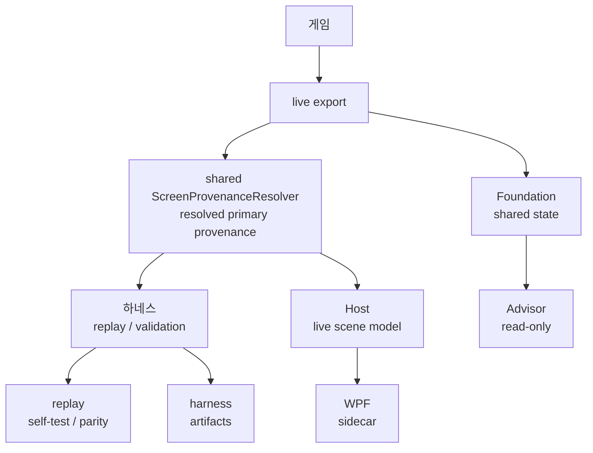
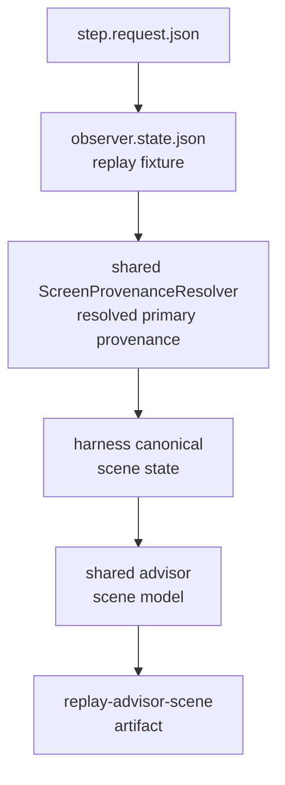
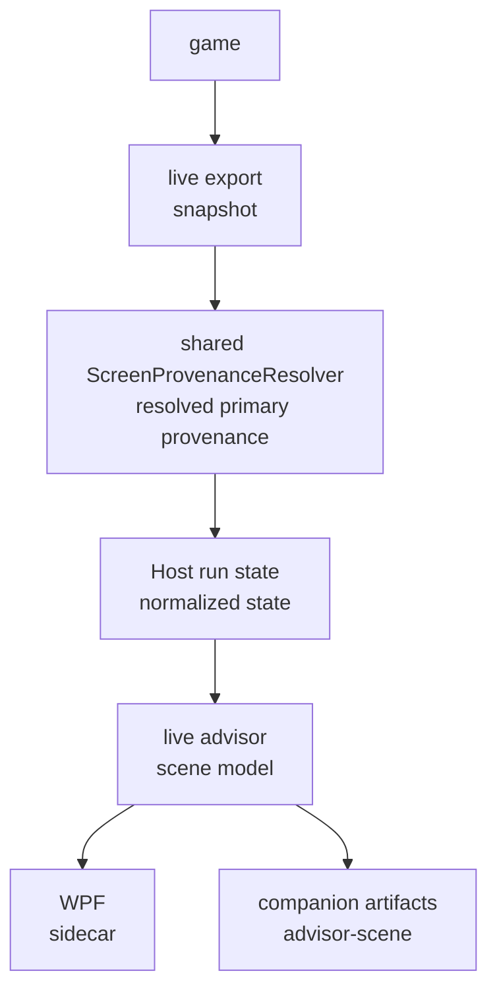
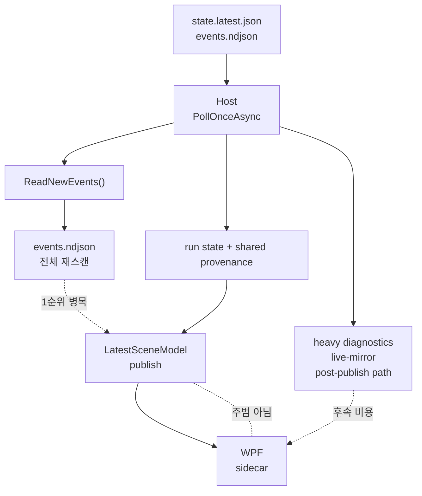

# 하네스에서 M9 구조를 읽는 방법

> 상태: 현재 사용 중  
> 대상 독자: 하네스를 오래 다뤘지만 지금 전체 구조가 헷갈리는 사람  
> 목적: `하네스 / live export / Host / WPF sidecar / Foundation / Advisor` 경계를 한 번에 이해하게 돕기

## 이 문서의 한 줄 요약

지금 repo는 더 이상 `하네스 하나`만 보는 구조가 아니다.
`게임이 내보내는 원천 상태`와 `그 상태를 사람이 읽기 좋은 장면 모델로 바꾸는 경로`, 그리고 `그 결과를 WPF로 실시간 보여주는 경로`가 분리되어 있다.

즉:

```text
game -> live export -> shared ScreenProvenanceResolver -> Host -> WPF sidecar
game -> live export -> shared ScreenProvenanceResolver -> harness replay
game -> live export -> Foundation/Advisor
```

하네스는 여전히 중요하지만, 이제는 `주력 실행기`가 아니라 `검증용 proving ground`와 `회귀 방지용 acceptance lane`의 성격이 더 강하다.



## 계층별 역할

### 1. 게임 본체

실제 Slay the Spire 2 프로세스다.

이 계층의 책임은 단순하다.

- 화면을 띄운다
- 실제 플레이를 진행한다
- 상태를 화면/노드/메타로 노출한다

중요한 점:

- 게임은 `조언`을 만들지 않는다
- 게임은 `scene model`도 만들지 않는다
- 게임은 그냥 실제 truth를 갖고 있는 원천이다

### 2. live export

게임 내부 mod/exporter가 상태를 바깥으로 내보내는 계층이다.

여기서 하는 일은:

- snapshot을 만든다
- current choices, meta, recent changes, raw observations를 기록한다
- scene transition 힌트를 남긴다

이 계층은 `하네스`도 쓰고 `Host/WPF`도 쓰는 공통 기반이다.

중요한 구분:

- `live export`는 아직 사람이 읽기 좋은 최종 형태가 아니다
- `live export`는 원천 사실과 provenance를 담는 계층이다

### 3. 하네스

하네스는 `게임 상태를 해석하고, replay/validation/test를 돌리는 도구`다.

하네스가 책임지는 것은:

- replay parity
- scene authority 판정
- allowed actions
- decision/routing
- self-test
- artifact/replay 검증

하네스는 좋은 방향으로 많이 정리됐지만, 여전히 `행동을 결정하는 검증 레이어`다.

즉:

- 하네스는 “지금 이 장면이 무엇인가”를 정확히 판정하는 데 강하다
- 하지만 하네스 자체가 M9 live sidecar의 실시간 표시 UI는 아니다

### 4. Host

Host는 `live export snapshot을 읽어서 사람이 보는 scene model과 advisor state로 가공하는 런타임 브리지`다.

Host가 하는 일:

- live export 파일을 읽는다
- shared `ScreenProvenanceResolver`로 resolved `current / visible / ready / authority / stability`를 계산한다
- run state를 만든다
- canonical / normalized state를 계산한다
- live advisor scene model을 만든다
- WPF에 넘길 snapshot을 만든다
- artifacts를 남긴다

Host는 M9에서 매우 중요하다.

이유는 간단하다.

- 하네스는 replay 중심
- Host는 live play 중심
- WPF는 사람이 보는 중심

즉 `M9 live sidecar`의 실제 owner는 Host다.

### 5. WPF sidecar

WPF는 사람이 직접 보는 창이다.

이 계층의 책임은:

- current scene model을 보여준다
- summary를 보여준다
- options를 보여준다
- missing facts / observer gaps를 보여준다
- confidence / source refs를 보여준다
- scene-aware display formatter로 요약과 현재 장면 맥락을 분리해 보여 준다
- display-only sanitizer / knowledge resolver는 `src/Shared/AdvisorSceneDisplay/`, WPF formatter는 `src/Sts2AiCompanion.Wpf/Display/`에 둔다
- display-only knowledge/localization은 label과 description을 다듬는 데만 쓰고 truth source로 쓰지 않는다

WPF는 truth source가 아니다.

- WPF는 표시 계층이다
- WPF는 Host가 만든 scene model을 읽는 소비자다

### 6. Foundation

Foundation은 `공통 상태 / 공통 reasoning / 공통 knowledge / 공통 contract`가 모이는 기반 계층이다.

이 계층은:

- normalized state
- knowledge slice
- prompt packing
- replay validation
- advisor reasoning

같은 공통 논리를 담는다.

하지만 M9 live sidecar 초기 wave에서는 Foundation을 너무 빨리 중심으로 올리지 않는다.

이유:

- live sidecar는 실시간 표시 문제다
- 먼저 Host와 WPF 경계를 안정화하는 게 우선이다
- foundation merge pressure를 줄여야 한다

### 7. Advisor

Advisor는 `읽은 상태를 바탕으로 조언을 만드는 계층`이다.

중요한 점:

- Advisor는 액추에이터가 아니다
- Advisor는 조언자다
- 먼저 `read-only`가 목표다

M9에서는 다음 순서가 맞다.

1. scene model을 만든다
2. 사람이 읽는 sidecar를 만든다
3. 그 다음 read-only advisor를 얹는다
4. actuator는 마지막에 검토한다

## 데이터 흐름

### replay 경로

```text
step.request.json
  -> observer.state.json / replay fixture
  -> shared ScreenProvenanceResolver resolved provenance
  -> harness canonical scene state
  -> shared advisor scene model
  -> replay-advisor-scene artifact
```

이 경로는 `검증`이 목적이다.

핵심:

- replay와 live가 같은 schema를 쓰는지 확인
- 하네스가 scene를 정확히 읽는지 확인
- 사람이 읽는 summary가 stable한지 확인



### live 경로

```text
game
  -> live export snapshot
  -> shared ScreenProvenanceResolver resolved provenance
  -> Host run state / normalized state
  -> live advisor scene model
  -> WPF sidecar
  -> artifacts/companion/<runId>/advisor-scene/
```

이 경로는 `실시간 표시`가 목적이다.

핵심:

- 사령관이 직접 플레이하면서 현재 장면을 본다
- `sceneType / sceneStage / canonicalOwner`를 본다
- `missingFacts / observerGaps`를 본다
- 하네스와 live sidecar가 같은 schema를 쓰는지 본다



### advisor 경로

```text
live export / normalized state / knowledge slice
  -> advisor input contract
  -> read-only recommendation
```

이 경로는 아직 M9 후반이나 그 다음 단계다.

중요:

- scene model과 advisor input은 같은 것이 아니다
- scene model은 사실 정리
- advisor input은 판단용 요약

## 왜 하네스와 live sidecar가 다른 경로를 타는가

둘의 목적이 다르기 때문이다.

하지만 `resolved current / visible / ready / authority / stability`의 1차 provenance 해석은 shared `ScreenProvenanceResolver`로 맞춰야 한다.

### 하네스의 목적

- replay parity
- blocker 재현
- routing / allowed-actions 검증
- old path retirement

하네스는 `정확한 판정`에 강하다.

### live sidecar의 목적

- 실제 플레이 중 실시간 피드백
- 사람이 현재 장면을 읽기 쉽게 보기
- 현재 화면과 state model 대조

live sidecar는 `빠른 표시`와 `사람 친화성`이 중요하다.

그래서 둘은:

- primary provenance interpretation은 shared resolver로 같다
- canonical scene state를 쌓는 위치와 깊이가 다르고
- 최적화 포인트가 다르다

## 왜 하네스를 고친 것만으로 sidecar 지연이 자동 해결되지 않았나

이 부분이 제일 헷갈리기 쉽다.

이유는 `하네스가 늦어서`가 아니라, `live sidecar가 타는 경로`에 별도의 무거운 정책이 있었기 때문이다.

직관적으로 말하면:

- 하네스는 replay/validation 계약을 정리해 왔다
- live sidecar는 live export snapshot을 Host가 받아서 다시 scene model을 만든다
- 그런데 그 Host 경로 안에 예전 안정화 목적의 sticky merge, heavy diagnostics, collector summary 같은 비용이 있었다

즉:

```text
하네스는 이미 좋아졌는데
live sidecar는 아직 그 수준으로 가볍고 빠르지 않았다
```

그래서 다음이 동시에 가능했다.

- replay는 괜찮다
- live export 원천은 빨리 찍힌다
- 그런데 WPF scene panel은 늦게 바뀐다

이건 하네스 실패가 아니라 `live path 병목`이다.

## 왜 1GB를 읽게 됐는가

이 부분이 지금 sidecar 지연의 핵심이다.

처음 구현 의도 자체는 이해할 수 있다.

- Host는 `events.ndjson`에서 새 이벤트만 읽고 싶었다
- 그래서 `lastObservedSeq`를 들고 있었다
- 구현은 가장 단순한 방식으로 들어갔다
  - 파일 전체를 읽는다
  - 모든 줄을 다시 파싱한다
  - 그다음 `lastObservedSeq`보다 큰 것만 남긴다

작을 때는 이 방식이 충분했다.

- 이벤트 파일이 작으면 구현이 단순하고
- 파일 tail/cursor/truncate 처리도 신경 덜 써도 되고
- 새 세션/재시작에서도 안전하게 동작하기 쉽다

하지만 collector mode와 장시간 직접 플레이가 붙으면서 문제가 커졌다.

- `events.ndjson`가 계속 누적된다
- `raw-observations.ndjson`, `choice-candidates.ndjson`도 같이 커진다
- 그 상태에서 Host poll이 돌 때마다 파일 전체를 다시 훑으면
- sidecar는 “새 이벤트 몇 줄”만 필요해도 “과거 전체 기록”을 매번 다시 읽게 된다

쉽게 말하면:

```text
지금 필요한 것은
방금 추가된 마지막 몇 줄인데,
기존 구현은 매번 로그 파일 전체를 다시 읽고 있었다.
```

## 지금 밝혀진 병목 정리

현재 병목은 우선순위가 꽤 명확하다.



### 1. 최우선 병목: Host의 events 전체 재스캔

위치:

- [CompanionHost.cs](/mnt/c/users/jidon/source/repos/sts2_mod_ai_companion/src/Sts2AiCompanion.Host/CompanionHost.cs)

핵심 경로:

- `PollOnceAsync()`
- `ReadNewEvents(_layout.EventsPath, ...)`
- `ReadAllLinesShared()`
- `ReadToEnd()`

문제:

- `events.ndjson`를 poll마다 처음부터 끝까지 다시 읽었다
- `lastObservedSeq`는 비용 절감이 아니라 나중 필터로만 쓰였다

실측:

- `events.ndjson` 약 `1007MB`
- 전체 읽기 약 `8786ms`
- split 약 `268ms`
- parse 약 `692ms`

즉 sidecar가 10초 이상 늦는 것은 이상 현상이 아니라, 이 경로만으로도 거의 설명된다.

### 2. 후속 비용: Host diagnostics heavy path

위치:

- [CompanionHost.Diagnostics.cs](/mnt/c/users/jidon/source/repos/sts2_mod_ai_companion/src/Sts2AiCompanion.Host/CompanionHost.Diagnostics.cs)

여기서는 아래가 한 번에 비용을 키웠다.

- `events.ndjson` mirror copy
- `raw-observations.ndjson` mirror copy
- `choice-candidates.ndjson` mirror copy
- collector summary용 NDJSON 전체 파싱

현재 구현에서는 scene artifact publish가 이 경로보다 먼저 일어난다.

최근 수정으로 이쪽은 일부 완화했다.

- heavy mirror/summary를 저주기로 분리
- 바뀐 파일만 복사

즉 지금은 2차 병목이다.

### 3. WPF는 주범이 아니다

위치:

- [ShellViewModel.cs](/mnt/c/users/jidon/source/repos/sts2_mod_ai_companion/src/Sts2AiCompanion.Wpf/ShellViewModel.cs)

현재 구조는:

- `SnapshotChanged`
- 즉시 `Apply(snapshot)`
- scene panel 문자열 즉시 갱신

즉 WPF는 `늦게 받은 걸 늦게 그리는` 쪽이 아니라,
`Host가 늦게 준 걸 그대로 보여주는` 쪽에 가깝다.

## 지금 무엇을 고치고 있는가

현재 수정 방향은 두 단계다.

### 단계 1. diagnostics hot path를 느슨하게 분리

목표:

- scene model 실시간 반응과
- 무거운 collector/mirror 작업을 분리

효과:

- sidecar 실시간성에 필요 없는 작업이 poll hot path를 덜 막게 된다

### 단계 2. events reader를 incremental tail read로 교체

목표:

- `events.ndjson` 전체 재스캔 제거
- 파일 끝 tail에서 시작
- 이후는 append된 부분만 읽기
- partial line / run reset / file truncate만 예외 처리

이게 현재 sidecar 지연을 직접 줄이는 핵심 수정이다.

## 직접 플레이할 때 무엇을 어디서 책임지는가

### 게임

게임은 실제 화면과 실제 진행을 책임진다.

- 메뉴
- 이벤트
- 전투
- 보상
- 휴식처
- 상점
- 맵

### Exporter

Exporter는 게임에서 읽은 truth를 바깥으로 내보낸다.

- snapshot
- current choices
- meta
- recent events
- raw observations

Exporter가 늦거나 sticky하면, sidecar는 늦어진다.

### Host

Host는 exporter를 읽고 shared provenance를 거쳐 `scene model`로 바꾼다.

Host가 책임지는 것:

- resolved current / visible / ready / authority / stability
- sceneType
- sceneStage
- canonicalOwner
- summary
- options
- missingFacts
- observerGaps
- confidence
- sourceRefs

### WPF

WPF는 Host가 만든 scene model을 보여준다.

WPF가 책임지는 것:

- 사람이 즉시 읽을 수 있게 보여주기
- current scene model 패널 갱신
- actual game 화면과 대조하기 쉽게 만들기

### 하네스

하네스는 replay/test/validation에서 이 구조가 맞는지 확인한다.

즉 하네스가 책임지는 것은:

- “이 scene model이 맞는가”
- “이 replay schema가 live와 같은가”
- “이 data flow가 drift하지 않는가”

## 문제를 볼 때 어디를 의심해야 하나

직접 플레이하면서 느린 경우, 먼저 이렇게 나눈다.

### 1. 게임이 늦는가

- 실제 화면이 안 바뀌는가
- 버튼을 눌러도 전이가 안 되는가

이 경우는 게임 자체 issue다.

### 2. exporter가 늦는가

- 게임 화면은 바뀌었는데 `state.latest.json`이 늦게 바뀌는가
- 이벤트 로그는 빨리 찍히는데 snapshot이 늦게 붙는가

이 경우는 exporter/live export issue다.

### 3. Host가 늦는가

- `state.latest.json`은 빨리 바뀌는데 `advisor-scene.latest.json`이나 WPF가 늦는가

이 경우는 Host issue다.

### 4. WPF가 늦는가

- `advisor-scene.latest.json`은 바뀌는데 화면만 그대로인가

이 경우는 WPF binding/update issue다.

## M9에서 지금 보는 문서 순서

헷갈리면 아래 순서로 보면 된다.

1. [PROJECT_STATUS.md](../PROJECT_STATUS.md)
2. [M9_EXECUTION_PLAN_KO.md](../M9_EXECUTION_PLAN_KO.md)
3. [M9_LIVE_SIDECAR_UI_PLAN_KO.md](../M9_LIVE_SIDECAR_UI_PLAN_KO.md)
4. [ADVISOR_SCENE_MODEL_READER_KO.md](./ADVISOR_SCENE_MODEL_READER_KO.md)
5. [ADVISOR_UI_COVERAGE_MATRIX_KO.md](../ADVISOR_UI_COVERAGE_MATRIX_KO.md)
6. [ADVISOR_SCENE_INFORMATION_MODEL.md](/mnt/c/users/jidon/source/repos/sts2_mod_ai_companion/docs/contracts/ADVISOR_SCENE_INFORMATION_MODEL.md)
7. [ADVISOR_INPUT_OUTPUT_CONTRACT.md](/mnt/c/users/jidon/source/repos/sts2_mod_ai_companion/docs/contracts/ADVISOR_INPUT_OUTPUT_CONTRACT.md)

## 한 줄 결론

```text
하네스는 replay/validation의 중심이고,
live export는 원천 truth,
Host는 live scene model 생성,
WPF는 사람이 보는 sidecar,
Foundation은 공통 state/knowledge/reasoning,
Advisor는 그 위의 조언 계층이다.
```

이 순서로 보면, 지금 M9에서 왜 `scene model`, `sidecar`, `advisor`를 분리하는지 훨씬 덜 헷갈린다.
