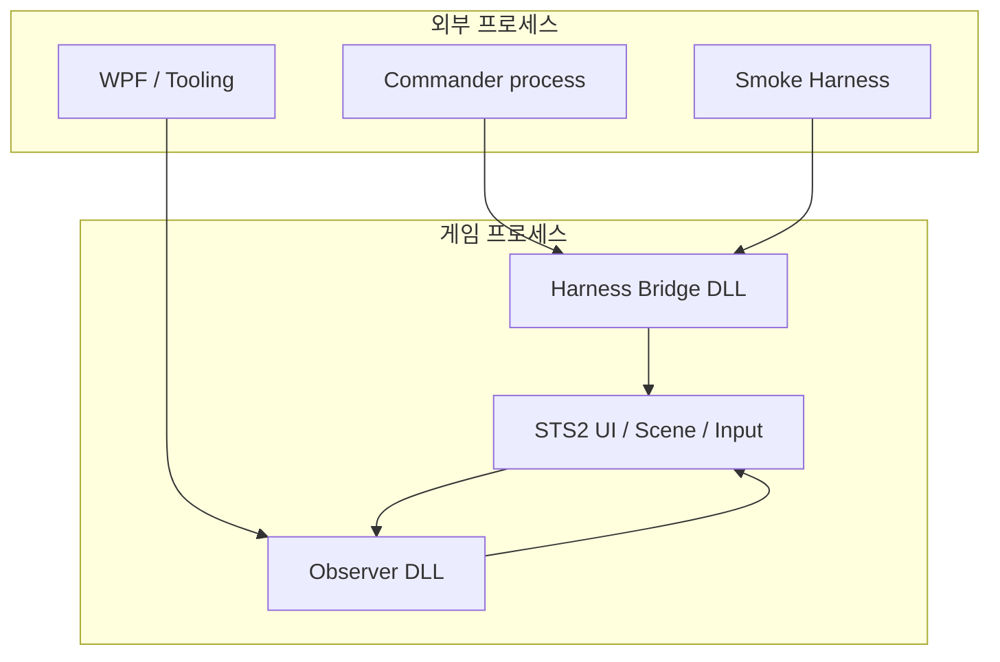
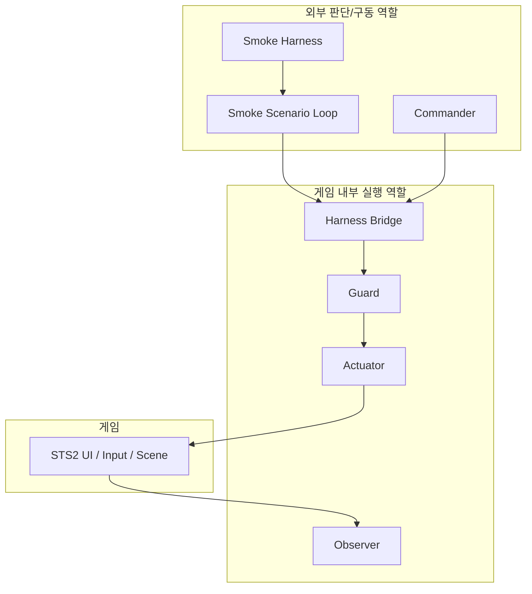
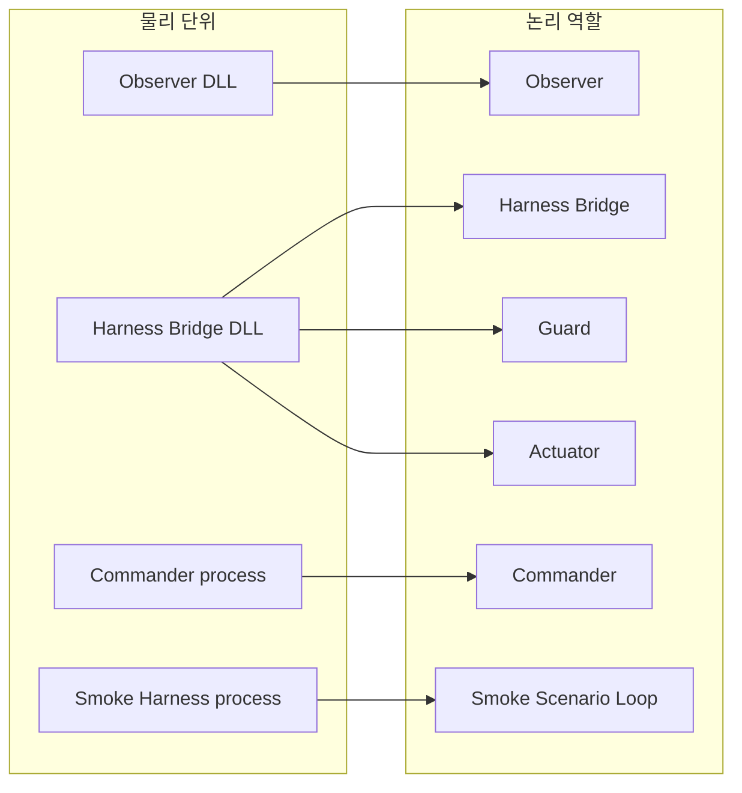
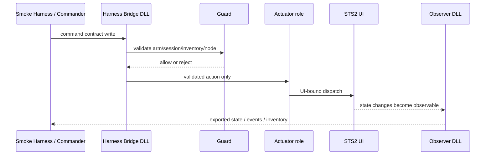

# STS2 Harness Layer Architecture

## 목적

이 문서는 아래 세 가지를 혼동하지 않도록 정리한다.

1. `외부 프로세스`
2. `인게임 DLL`
3. `논리 역할`

이 구분이 없으면 `Observer`, `Actuator`, `Harness Bridge`, `Smoke Harness`, `Commander`를 서로 다른 축에서 섞어 말하게 된다.

## 핵심 결론

현재 구조를 가장 정확하게 요약하면 아래와 같다.

- 게임 밖:
  - `Commander process`
  - `Smoke Harness`
  - WPF / Tooling / 기타 외부 도구
- 게임 안:
  - `Observer DLL`
  - `Harness Bridge DLL`
- 논리 역할:
  - `Observer`
  - `Guard`
  - `Actuator`
  - `Commander`
  - `Smoke Scenario Loop`

중요:

- `Actuator`는 현재 **별도 물리 DLL이 아니다**.
- 현재 `Actuator`는 **Harness Bridge DLL 내부 역할**이다.
- 따라서 현재 배포 단위를 정확히 말하면:
  - `Observer DLL`
  - `Harness Bridge DLL`
이다.

## 1. 물리 배포 단위와 실행 위치

이 그래프는 “무엇이 어디서 실행되는가”만 보여준다.

## 2. 논리 역할 구조

이 그래프는 “누가 어떤 책임을 가지는가”를 보여준다.

## 3. 물리 단위와 논리 역할의 대응

이 그래프가 가장 중요하다.

여기서 봐야 할 점:

- `Observer`는 현재 `Observer DLL`과 거의 1:1 대응한다.
- `Harness Bridge`, `Guard`, `Actuator`는 현재 모두 `Harness Bridge DLL` 안에 들어 있다.
- `Smoke Scenario Loop`는 별도 제품 레이어가 아니라 `Smoke Harness process` 내부 상태 머신이다.

## 3.1 실제 DLL 이름과 포함 역할

현재 물리 DLL은 아래 두 개를 기준으로 이해한다.

| 물리 DLL | 실제 출력 이름 | 현재 포함 역할 |
| --- | --- | --- |
| Observer DLL | `Sts2ModAiCompanion.Mod.dll` | `Observer` 중심 런타임 exporter |
| Harness Bridge DLL | `Sts2ModAiCompanion.HarnessBridge.dll` | `Harness Bridge`, `Guard`, `Actuator role` |

추가 설명:

- 두 프로젝트 모두 `.csproj`에 `AssemblyName` override가 없으므로 출력 DLL 이름은 프로젝트명과 같다.
- 즉 현재 인게임 핵심 DLL을 말할 때는 아래처럼 부르면 된다.
  - `Observer DLL = Sts2ModAiCompanion.Mod.dll`
  - `Harness Bridge DLL = Sts2ModAiCompanion.HarnessBridge.dll`
- `Actuator`는 현재 별도 DLL이 아니므로 `Actuator DLL`이라고 부르지 않는다.

## 4. 용어 고정

### 외부 프로세스

게임 프로세스 밖에서 실행되는 프로그램이다.

예:

- `Commander process`
- `Smoke Harness process`
- WPF
- Tooling

### Observer DLL

현재 물리 배포 단위로서의 observer 쪽 인게임 DLL이다.

코드 위치:

- [AiCompanionModEntryPoint.cs](C:\Users\jidon\source\repos\STS2_Mod_AI_Companion\src\Sts2ModAiCompanion.Mod\AiCompanionModEntryPoint.cs)
- [RuntimeExportContext.cs](C:\Users\jidon\source\repos\STS2_Mod_AI_Companion\src\Sts2ModAiCompanion.Mod\Runtime\RuntimeExportContext.cs)
- [RuntimeSnapshotReflectionExtractor.cs](C:\Users\jidon\source\repos\STS2_Mod_AI_Companion\src\Sts2ModAiCompanion.Mod\Runtime\RuntimeSnapshotReflectionExtractor.cs)

### Harness Bridge DLL

현재 물리 배포 단위로서의 command ingress / guard / actuation 쪽 인게임 DLL이다.

코드 위치:

- [HarnessBridgeEntryPoint.cs](C:\Users\jidon\source\repos\STS2_Mod_AI_Companion\src\Sts2ModAiCompanion.HarnessBridge\HarnessBridgeEntryPoint.cs)
- [HarnessBridgeHost.cs](C:\Users\jidon\source\repos\STS2_Mod_AI_Companion\src\Sts2ModAiCompanion.HarnessBridge\HarnessBridgeHost.cs)
- [ActionQueueScanner.cs](C:\Users\jidon\source\repos\STS2_Mod_AI_Companion\src\Sts2ModAiCompanion.HarnessBridge\ActionQueueScanner.cs)
- [ArmSessionReader.cs](C:\Users\jidon\source\repos\STS2_Mod_AI_Companion\src\Sts2ModAiCompanion.HarnessBridge\ArmSessionReader.cs)
- [InventoryPublisher.cs](C:\Users\jidon\source\repos\STS2_Mod_AI_Companion\src\Sts2ModAiCompanion.HarnessBridge\InventoryPublisher.cs)

### Actuator

논리 역할 이름이다.

현재는 **별도 DLL이 아니라** `Harness Bridge DLL` 내부 역할이다.

따라서 다음 표현이 정확하다.

- 맞음: `Actuator role`
- 맞음: `Actuator inside Harness Bridge DLL`
- 부정확함: `Actuator DLL`

단, 미래에 실제로 별도 DLL로 분리하면 그때 `Actuator DLL`이라고 부를 수 있다.

### Commander process

게임 밖에서 observer 출력과 기타 증거를 읽고 다음 행동을 결정하는 외부 주체다.

현재는 아직 최종 AI commander가 완전히 닫히지 않았고, 일부 단계는 수동/스크립트/개발용 decision provider가 대신한다.

### Smoke Harness

개발용 black-box smoke 도구 전체를 가리킨다.

코드 위치:

- [Sts2GuiSmokeHarness.csproj](C:\Users\jidon\source\repos\STS2_Mod_AI_Companion\src\Sts2GuiSmokeHarness\Sts2GuiSmokeHarness.csproj)
- [Program.cs](C:\Users\jidon\source\repos\STS2_Mod_AI_Companion\src\Sts2GuiSmokeHarness\Program.cs)

### Smoke Scenario Loop

`Smoke Harness process` 내부 단계 진행 상태 머신이다.

현재 구현에서는 [Program.cs](C:\Users\jidon\source\repos\STS2_Mod_AI_Companion\src\Sts2GuiSmokeHarness\Program.cs)의 `RunScenarioAsync(...)` 루프가 이 역할이다.

중요:

- `Smoke Scenario Loop`는 별도 제품 레이어가 아니다.
- `Scenario Runner`라는 말을 여기에 쓰지 않는다.

### Legacy Scenario Runner

기존 harness closed-loop 실행기다.

코드 위치:

- [ScenarioRunner.cs](C:\Users\jidon\source\repos\STS2_Mod_AI_Companion\src\Sts2AiCompanion.Harness\Scenarios\ScenarioRunner.cs)

이 타입은 기존 `Sts2AiCompanion.Harness` 쪽 시나리오 실행기이므로, GUI 스모크 하네스 내부 루프와 구분해서 `Legacy Scenario Runner`라고 부른다.

## 5. 실제 명령 흐름

핵심:

- 외부는 직접 게임 함수를 호출하지 않는다.
- `Harness Bridge DLL`이 중간에서 command contract를 받아 `Guard`와 `Actuator` 경로를 통과시킨다.
- 최종 상태 진실값은 여전히 `Observer DLL`이 내보낸다.

## 6. 현재 기준으로 가장 안전한 말하기 규칙

앞으로는 아래처럼 말한다.

- `외부 프로세스`
- `인게임 DLL`
- `Observer DLL`
- `Harness Bridge DLL`
- `Actuator role`
- `Commander process`
- `Smoke Harness`
- `Smoke Scenario Loop`
- `Legacy Scenario Runner`

아래 표현은 현재 시점에서는 피한다.

- `Actuator DLL`
- `GUI 하네스의 scenario runner`
- `Command Bridge`

대신 이렇게 바꿔 말한다.

- `Actuator role inside Harness Bridge DLL`
- `Smoke Scenario Loop`
- `Harness Bridge`

## 7. 현재 우선순위와 이 문서의 의미

지금 프로젝트는 최종 `Commander`를 완성하는 단계가 아니라, 먼저 아래를 안정화하는 단계다.

1. `Observer DLL`의 authoritative state export
2. `Harness Bridge DLL`의 guard/bridge 경계
3. `Smoke Harness`를 통한 반복 acceptance 자동화

즉 이 문서의 목적은:

- observer와 actuator를 제품 구조로 분리해서 이해하되
- 현재 물리 구현은 `Observer DLL + Harness Bridge DLL`이라는 점을 분명히 하고
- 외부 테스트 도구인 `Smoke Harness`를 제품 내부 레이어와 혼동하지 않게 만드는 것이다.
