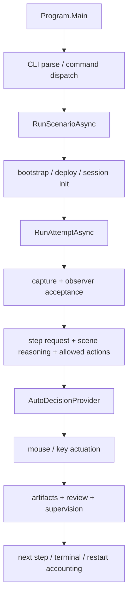

# GuiSmokeHarness Architecture

> Status: Live Reference
> Source of truth: Yes, for current `Sts2GuiSmokeHarness` file ownership and runtime layering
> Update when: module ownership, runtime flow, shell boundaries, or validation surfaces change

## 0. 목적

이 문서는 current `main` 기준 `Sts2GuiSmokeHarness`의 실제 구조를 사람이 빠르게 읽기 위한 architecture reference다.

이 문서가 답해야 하는 질문은 다음이다.

1. 지금 하네스 entrypoint는 어디인가
2. step loop는 어떤 레이어로 분리되어 있는가
3. observer / analysis / decisions / runner / artifacts가 각각 무엇을 소유하는가
4. current blocker를 좁힐 때 어떤 파일부터 열어야 하는가
5. self-test / replay / live validation은 어디와 연결되는가

current blocker 자체는 `docs/current/`에서 관리한다. 이 문서는 구조와 owner를 설명한다.

## 1. 한눈에 보는 현재 구조

current `main`의 `Sts2GuiSmokeHarness`는 다음 구조로 읽는다.

- shell / CLI
  - [Program.cs](../../../src/Sts2GuiSmokeHarness/Program.cs)
  - [Program.Cli.cs](../../../src/Sts2GuiSmokeHarness/Program.Cli.cs)
  - [Program.InspectAndReplay.cs](../../../src/Sts2GuiSmokeHarness/Program.InspectAndReplay.cs)
- runner
  - [Program.Runner.cs](../../../src/Sts2GuiSmokeHarness/Program.Runner.cs)
  - [Program.Runner.Bootstrap.cs](../../../src/Sts2GuiSmokeHarness/Program.Runner.Bootstrap.cs)
  - [Program.Runner.Deploy.cs](../../../src/Sts2GuiSmokeHarness/Program.Runner.Deploy.cs)
  - [Program.Runner.AttemptLifecycle.cs](../../../src/Sts2GuiSmokeHarness/Program.Runner.AttemptLifecycle.cs)
- contracts / support
  - [GuiSmokeRuntimeContracts.cs](../../../src/Sts2GuiSmokeHarness/GuiSmokeRuntimeContracts.cs)
  - [GuiSmokeReplayContracts.cs](../../../src/Sts2GuiSmokeHarness/GuiSmokeReplayContracts.cs)
  - [GuiSmokeObserverContracts.cs](../../../src/Sts2GuiSmokeHarness/GuiSmokeObserverContracts.cs)
  - [GuiSmokeDecisionContracts.cs](../../../src/Sts2GuiSmokeHarness/GuiSmokeDecisionContracts.cs)
  - [GuiSmokeNonCombatSceneContracts.cs](../../../src/Sts2GuiSmokeHarness/GuiSmokeNonCombatSceneContracts.cs)
  - [GuiSmokeChoicePrimitiveSupport.cs](../../../src/Sts2GuiSmokeHarness/GuiSmokeChoicePrimitiveSupport.cs)
  - [GuiSmokeShared.cs](../../../src/Sts2GuiSmokeHarness/GuiSmokeShared.cs)
- observer / canonical ownership
  - [Observer/GuiSmokeObserverPhaseHeuristics.cs](../../../src/Sts2GuiSmokeHarness/Observer/GuiSmokeObserverPhaseHeuristics.cs)
  - [Observer/RootSceneTransitionObserverSignals.cs](../../../src/Sts2GuiSmokeHarness/Observer/RootSceneTransitionObserverSignals.cs)
  - [Observer/NonCombatForegroundOwnership.cs](../../../src/Sts2GuiSmokeHarness/Observer/NonCombatForegroundOwnership.cs)
  - room-specific `*ObserverSignals.cs`
- analysis
  - [Analysis/AutoMapAnalyzer.cs](../../../src/Sts2GuiSmokeHarness/Analysis/AutoMapAnalyzer.cs)
  - [Analysis/AutoCardGridAnalyzers.cs](../../../src/Sts2GuiSmokeHarness/Analysis/AutoCardGridAnalyzers.cs)
  - [Analysis/AutoCombatAnalyzer.cs](../../../src/Sts2GuiSmokeHarness/Analysis/AutoCombatAnalyzer.cs)
  - [Analysis/CombatTargetabilitySupport.cs](../../../src/Sts2GuiSmokeHarness/Analysis/CombatTargetabilitySupport.cs)
- decisions
  - [AutoDecisionProvider.Core.cs](../../../src/Sts2GuiSmokeHarness/AutoDecisionProvider.Core.cs)
  - [AutoDecisionProvider.RunFlow.cs](../../../src/Sts2GuiSmokeHarness/AutoDecisionProvider.RunFlow.cs)
  - [AutoDecisionProvider.NonCombatSceneState.cs](../../../src/Sts2GuiSmokeHarness/AutoDecisionProvider.NonCombatSceneState.cs)
  - [AutoDecisionProvider.NonCombatDecisions.cs](../../../src/Sts2GuiSmokeHarness/AutoDecisionProvider.NonCombatDecisions.cs)
  - [AutoDecisionProvider.CombatDecisions.cs](../../../src/Sts2GuiSmokeHarness/AutoDecisionProvider.CombatDecisions.cs)
  - [AutoDecisionProvider.DecisionFactories.cs](../../../src/Sts2GuiSmokeHarness/AutoDecisionProvider.DecisionFactories.cs)
- phase / request orchestration helpers
  - [Program.StepRequests.cs](../../../src/Sts2GuiSmokeHarness/Program.StepRequests.cs)
  - [Program.SceneReasoning.cs](../../../src/Sts2GuiSmokeHarness/Program.SceneReasoning.cs)
  - [Program.AllowedActions.NonCombat.cs](../../../src/Sts2GuiSmokeHarness/Program.AllowedActions.NonCombat.cs)
  - [Program.AllowedActions.Combat.cs](../../../src/Sts2GuiSmokeHarness/Program.AllowedActions.Combat.cs)
  - [Program.PhaseFailureHints.cs](../../../src/Sts2GuiSmokeHarness/Program.PhaseFailureHints.cs)
  - [Program.PhaseLoopRouting.cs](../../../src/Sts2GuiSmokeHarness/Program.PhaseLoopRouting.cs)
  - [Program.ProgressAndValidation.cs](../../../src/Sts2GuiSmokeHarness/Program.ProgressAndValidation.cs)
- artifacts / supervision
  - [LongRunArtifacts.Contracts.cs](../../../src/Sts2GuiSmokeHarness/LongRunArtifacts.Contracts.cs)
  - [LongRunArtifacts.Startup.cs](../../../src/Sts2GuiSmokeHarness/LongRunArtifacts.Startup.cs)
  - [LongRunArtifacts.Review.cs](../../../src/Sts2GuiSmokeHarness/LongRunArtifacts.Review.cs)
  - [LongRunArtifacts.Supervision.cs](../../../src/Sts2GuiSmokeHarness/LongRunArtifacts.Supervision.cs)
  - [LongRunArtifacts.PlateauDiagnostics.cs](../../../src/Sts2GuiSmokeHarness/LongRunArtifacts.PlateauDiagnostics.cs)
  - [LongRunArtifacts.Storage.cs](../../../src/Sts2GuiSmokeHarness/LongRunArtifacts.Storage.cs)
- interop
  - [Interop/ScreenCaptureService.cs](../../../src/Sts2GuiSmokeHarness/Interop/ScreenCaptureService.cs)
  - [Interop/MouseInputDriver.cs](../../../src/Sts2GuiSmokeHarness/Interop/MouseInputDriver.cs)
  - [Interop/WindowLocator.cs](../../../src/Sts2GuiSmokeHarness/Interop/WindowLocator.cs)
  - [Artifacts/GuiSmokeVideoRecorder.cs](../../../src/Sts2GuiSmokeHarness/Artifacts/GuiSmokeVideoRecorder.cs)
- testing
  - [Program.SelfTest.cs](../../../src/Sts2GuiSmokeHarness/Program.SelfTest.cs)
  - [Program.SelfTests.*.cs](../../../src/Sts2GuiSmokeHarness)

현재 shell은 [Program.cs](../../../src/Sts2GuiSmokeHarness/Program.cs) `56` lines다. `Program.cs`는 더 이상 canonical behavior owner가 아니다.

## 2. 런타임 흐름

### 2.1 Shell / CLI

- `Program.Main`은 command dispatch만 한다.
- `run`, `inspect-run`, `inspect-session`, `replay-step`, `replay-test`, `replay-parity-test`, `self-test` surface는 유지된다.
- option parsing과 usage는 CLI layer가 소유한다.

### 2.2 Runner

- `RunScenarioAsync`는 session-level orchestration을 소유한다.
- deploy/verification/bootstrap/manual-clean-boot/startup runtime evidence는 runner support와 `LongRunArtifacts.Startup`이 공동으로 소유한다.
- `RunAttemptAsync`는 attempt lifecycle orchestrator다.

### 2.3 Observer

- scene authority, foreground ownership, phase handoff는 observer layer만 canonical owner다.
- `currentScreen`은 logical/flow screen이고, foreground owner와 동일어가 아니다.
- `visible/open != canonical foreground owner` 규칙은 observer layer에서 enforced된다.

### 2.4 Analysis

- screenshot 기반 raw geometry, card grid, map node, overlay, combat target 추론은 analysis layer가 소유한다.
- decision layer는 analysis 결과를 소비하지만, raw image interpretation owner가 아니다.

### 2.5 Decisions

- `AutoDecisionProvider`는 action selection owner다.
- noncombat scene-state build와 noncombat decision selection은 분리되어 있다.
- combat targetability와 combat policy는 combat decision/support owner만 가진다.

### 2.6 Artifacts / Supervision

- startup evidence, restart chronology, session summary, supervisor verdict, plateau diagnostics는 `LongRunArtifacts.*`가 소유한다.
- runner는 artifact를 기록하지만, chronology projection semantics owner는 아니다.

### 2.7 Testing

- self-test는 production owner를 따라가는 verification layer다.
- replay-test / replay-parity-test는 saved request vs rebuilt request semantic drift를 고정한다.

## 3. Canonical owner 규칙

핵심 원칙은 아래로 고정한다.

1. one concept = one owner
2. `Build*`, `Resolve*`, `Decide*` 책임을 섞지 않는다
3. observer-derived authority를 decision layer가 다시 재해석하지 않는다
4. long-run artifact projection은 runner helper가 아니라 `LongRunArtifacts`가 소유한다
5. self-test는 semantics owner가 아니라 verification consumer다

빠른 매핑:

- scene authority / handoff: `Observer/*`
- screenshot analysis: `Analysis/*`
- action choice: `AutoDecisionProvider.*`
- step request / scene signature / allowed action synthesis: `Program.StepRequests.cs`, `Program.SceneReasoning.cs`, `Program.AllowedActions.*.cs`
- step loop / terminal classification: `Program.Runner.AttemptLifecycle.cs`, `Program.PhaseLoopRouting.cs`
- startup / chronology / supervisor: `LongRunArtifacts.*`

## 4. Current hotspots

2026-03-28 기준 남아 있는 주요 파일은 다음이다.

- [Program.Runner.AttemptLifecycle.cs](../../../src/Sts2GuiSmokeHarness/Program.Runner.AttemptLifecycle.cs) `1516` lines
- [Program.PhaseLoopRouting.cs](../../../src/Sts2GuiSmokeHarness/Program.PhaseLoopRouting.cs) `1135` lines
- [Program.SelfTests.NonCombatForegroundOwnership.cs](../../../src/Sts2GuiSmokeHarness/Program.SelfTests.NonCombatForegroundOwnership.cs) `1178` lines
- [Program.SelfTests.StartupRuntimeEvidence.cs](../../../src/Sts2GuiSmokeHarness/Program.SelfTests.StartupRuntimeEvidence.cs) `1044` lines

이 네 파일은 아직 localized maintenance hotspot으로 본다. 다만 예전 monolithic `Program.cs`와 달리, current blocker를 볼 때 전체 하네스를 한 파일에서 읽을 필요는 없다.

## 5. Validation surfaces

현재 canonical validation surface는 아래로 읽는다.

- build
  - `cmd.exe /c dotnet build STS2_Mod_AI_Companion.sln`
- shared self-test
  - `cmd.exe /c dotnet run --project src/Sts2ModKit.SelfTest/Sts2ModKit.SelfTest.csproj --no-build`
- harness self-test
  - `cmd.exe /c dotnet run --project src/Sts2GuiSmokeHarness/Sts2GuiSmokeHarness.csproj --no-build -- self-test`
- replay golden suite
  - `cmd.exe /c dotnet run --project src/Sts2GuiSmokeHarness/Sts2GuiSmokeHarness.csproj --no-build -- replay-test`
- replay parity suite
  - `cmd.exe /c dotnet run --project src/Sts2GuiSmokeHarness/Sts2GuiSmokeHarness.csproj --no-build -- replay-parity-test`

2026-03-28 기준 parity baseline은 green이며, old `reward-aftermath-map-handoff` red는 닫혔다.

## 6. Current semantic follow-up pointers

현재 architecture work는 정리됐고, semantic follow-up은 아래 파일들부터 보는 것이 맞다.

- combat post-wait / barrier / targetability coverage
  - [Program.AllowedActions.Combat.cs](../../../src/Sts2GuiSmokeHarness/Program.AllowedActions.Combat.cs)
  - [AutoDecisionProvider.CombatDecisions.cs](../../../src/Sts2GuiSmokeHarness/AutoDecisionProvider.CombatDecisions.cs)
  - [Analysis/CombatBarrierSupport.cs](../../../src/Sts2GuiSmokeHarness/Analysis/CombatBarrierSupport.cs)
  - [Analysis/CombatTargetabilitySupport.cs](../../../src/Sts2GuiSmokeHarness/Analysis/CombatTargetabilitySupport.cs)
- startup / trust / restart chronology
  - [Program.Runner.Bootstrap.cs](../../../src/Sts2GuiSmokeHarness/Program.Runner.Bootstrap.cs)
  - [Program.Runner.Deploy.cs](../../../src/Sts2GuiSmokeHarness/Program.Runner.Deploy.cs)
  - [LongRunArtifacts.Startup.cs](../../../src/Sts2GuiSmokeHarness/LongRunArtifacts.Startup.cs)
  - [LongRunArtifacts.Supervision.cs](../../../src/Sts2GuiSmokeHarness/LongRunArtifacts.Supervision.cs)
- combat targeting / no-op / barrier semantics
  - [Analysis/CombatTargetabilitySupport.cs](../../../src/Sts2GuiSmokeHarness/Analysis/CombatTargetabilitySupport.cs)
  - [Analysis/CombatBarrierSupport.cs](../../../src/Sts2GuiSmokeHarness/Analysis/CombatBarrierSupport.cs)
  - [AutoDecisionProvider.CombatDecisions.cs](../../../src/Sts2GuiSmokeHarness/AutoDecisionProvider.CombatDecisions.cs)

## 7. Related docs

- module boundary contract:
  - [GUI_SMOKE_HARNESS_MODULE_BOUNDARIES.md](../../contracts/GUI_SMOKE_HARNESS_MODULE_BOUNDARIES.md)
- startup/deploy sequencing:
  - [STARTUP_DEPLOY_CONTROL_LAYER.md](../../contracts/STARTUP_DEPLOY_CONTROL_LAYER.md)
- runner/supervisor chronology:
  - [RUNNER_SUPERVISOR_AGENT_ARCHITECTURE.md](../../contracts/RUNNER_SUPERVISOR_AGENT_ARCHITECTURE.md)
- current status / blocker:
  - [PROJECT_STATUS.md](../../current/PROJECT_STATUS.md)
  - [AI_SESSION_HANDOFF_KO.md](../../current/AI_SESSION_HANDOFF_KO.md)
