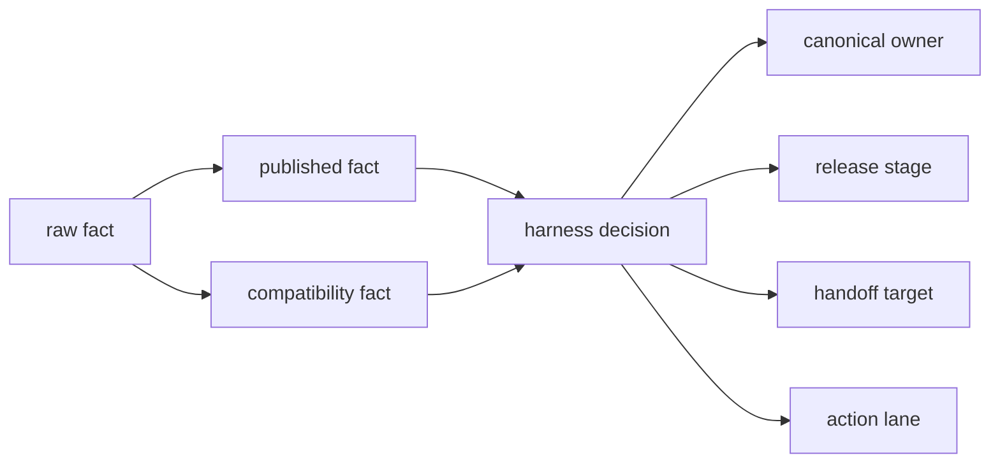
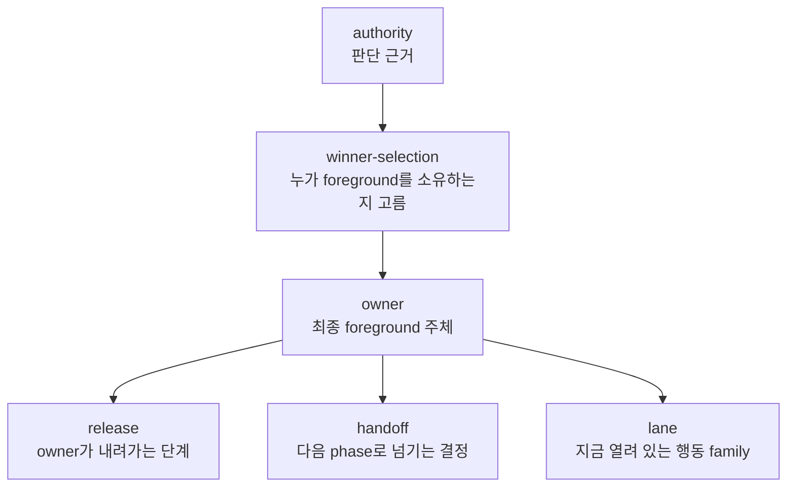

# GuiSmokeHarness 용어집

이 문서는 `Sts2GuiSmokeHarness`와 관련 observer/export/bridge 문서에서 반복해서 쓰이는 용어를 한곳에 모은 glossary입니다.

목표는 세 가지입니다.

1. source code 필드 이름과 내부 shorthand를 구분해서 설명하기
2. 세션 중 만들어진 표현을 사람이 다시 읽어도 바로 이해되게 하기
3. `owner`, `winner`, `compat`, `lane`처럼 자주 헷갈리는 단어를 같은 기준으로 고정하기

관련 문서:

- 현재 구조: [GUI_SMOKE_HARNESS_ARCHITECTURE.md](./GUI_SMOKE_HARNESS_ARCHITECTURE.md)
- 전/후 비교: [GUI_SMOKE_HARNESS_REFACTOR_BEFORE_AFTER.md](./GUI_SMOKE_HARNESS_REFACTOR_BEFORE_AFTER.md)
- cleanup 완료 계약: [../../contracts/GUI_SMOKE_HARNESS_MODULE_BOUNDARIES.md](../../contracts/GUI_SMOKE_HARNESS_MODULE_BOUNDARIES.md)
- current status: [../../current/PROJECT_STATUS.md](../../current/PROJECT_STATUS.md)

## 먼저 보는 핵심 구분

| 헷갈리기 쉬운 쌍 | 짧은 설명 |
|---|---|
| `raw` vs `published` vs `compatibility` | raw는 가장 직접적인 사실, published는 현재 export의 1차 표면, compatibility는 legacy/fallback 호환 표면 |
| `authority` vs `owner` | authority는 판단 근거, owner는 그 근거를 종합해 선택한 최종 foreground 주체 |
| `winner-selection` vs `owner` | winner-selection은 "누가 이겼는지 고르는 행위", owner는 그 결과 |
| `screen` vs `scene` | screen은 보통 문자열 라벨, scene은 더 넓은 semantic surface 또는 inventory scene type 맥락 |
| `phase` vs `lane` | phase는 step loop 상태, lane은 그 phase 안의 행동 family |
| `explicit lane` vs `fallback lane` | explicit는 exported/runtime truth로 바로 결정, fallback은 screenshot/heuristic이 필요 |
| `proof root` vs `authoritative root` | proof root는 근거용 retained run root, authoritative root는 현재 판단의 기준 root |

## 한눈에 보는 관계

## 1. Provenance 용어

### `raw fact`

| 항목 | 설명 |
|---|---|
| 의미 | runtime extractor가 가장 직접적으로 읽은 사실 |
| 예 | `rawCurrentScreen`, `rawObservedScreen`, raw active screen type, raw overlay/modal truth |
| 어디서 보나 | `RuntimeSnapshotReflectionExtractor`, `LiveExportSnapshot`, `ObserverSnapshotReader` |
| 주의 | raw는 "정제되지 않은 값"이지, 자동으로 "더 중요하다"는 뜻은 아니다 |

### `published fact`

| 항목 | 설명 |
|---|---|
| 의미 | 현재 export/bridge가 1차적으로 외부 소비자에게 publish하는 값 |
| 예 | `publishedCurrentScreen`, `publishedVisibleScreen`, `publishedSceneReady`, `publishedSceneAuthority`, `publishedSceneStability` |
| 어디서 보나 | `LiveExportSnapshot`, `HarnessNodeInventory`, `ObserverSnapshotReader`, `ObserverScreenProvenance.StrictPublished*` |
| 주의 | published는 "현재 export 표면의 주값"이라는 뜻이다. harness가 최종 semantic winner를 이미 결정했다는 뜻은 아니다 |

### `compatibility fact`

| 항목 | 설명 |
|---|---|
| 의미 | 과거 계약과의 호환을 위해 남겨 둔 legacy 또는 fallback 값 |
| 예 | `CompatibilityCurrentScreen`, `CompatibilityVisibleScreen`, `CompatibilitySceneReady` |
| 어디서 보나 | `LiveExportSnapshot`, `HarnessNodeInventory`, `ObserverSnapshotReader`, `ObserverScreenProvenance.StrictCompatibility*` |
| 주의 | compatibility는 현재 primary truth가 아니다. 새 code path가 여기에 직접 의존하면 다시 old synthetic shadow로 돌아간다 |

### `compat shadow`

| 항목 | 설명 |
|---|---|
| 의미 | compat field가 직접 winner는 아니더라도 control-flow fallback으로 남아 실제 판단에 그림자처럼 영향 주는 상태 |
| 어디서 보나 | `ObserverScreenProvenance.ControlFlow*` helper |
| 주의 | compat를 "남겨만 둔다"와 "실제로 still matters"는 다르다. compat shadow가 있으면 아직 semantic blast radius가 남아 있다 |

### `strict`

| 항목 | 설명 |
|---|---|
| 의미 | provenance fallback 없이 해당 표면만 읽는 helper라는 뜻 |
| 예 | `StrictPublishedCurrentScreen`, `StrictCompatibilitySceneReady` |
| 주의 | strict helper는 "정확한 provenance 읽기"용이다. broad display/helper와 다르다 |

## 2. Screen / Scene / Provenance helper 용어

### `current screen`

| 항목 | 설명 |
|---|---|
| 의미 | 현재 export가 가리키는 대표 screen 문자열 |
| 예 | `main-menu`, `map`, `rewards`, `combat` |
| 주의 | current screen은 foreground owner와 같은 뜻이 아니다 |

### `visible screen`

| 항목 | 설명 |
|---|---|
| 의미 | 현재 관찰상 보이는 screen surface |
| 주의 | visible/open이 foreground owner와 같지 않을 수 있다 |
| 예 | reward aftermath에서 `visible screen = map`, 하지만 foreground owner 판단은 release/handoff와 함께 봐야 한다 |

### `scene`

| 항목 | 설명 |
|---|---|
| 의미 | screen보다 넓은 semantic surface 또는 inventory scene type 맥락 |
| 주의 | 문맥에 따라 `SceneType`, `sceneReady`, `sceneAuthority`처럼 bridge/export 쪽 메타를 가리키기도 한다 |

### `direct`

| 항목 | 설명 |
|---|---|
| 의미 | published/compat fallback 없이 raw runtime/export 값을 직접 읽는 helper |
| 예 | `DirectCurrentScreen`, `DirectObservedScreen` |

### `control-flow screen`

| 항목 | 설명 |
|---|---|
| 의미 | harness가 phase routing과 acceptance에서 실제로 쓰는 screen helper |
| 현재 규칙 | 대체로 `published -> direct/raw -> compatibility` 순 |
| 주의 | display용 helper와 다르다 |

### `display screen`

| 항목 | 설명 |
|---|---|
| 의미 | 사람에게 보여 주기 쉬운 diagnostic alias |
| 주의 | display는 canonical branching input이 아니다 |

## 3. Semantic 판단 용어

### `authority`

| 항목 | 설명 |
|---|---|
| 의미 | owner를 결정하기 위한 근거 신호 |
| 예 | `rewardForegroundOwned`, `mapCurrentActiveScreen`, active screen type, explicit exported choices |
| 주의 | authority는 결과가 아니다. 여러 authority가 충돌할 수 있다 |

### `winner-selection`

| 항목 | 설명 |
|---|---|
| 의미 | conflicting facts 중 "지금 foreground를 누가 소유하는가"를 고르는 행위 |
| 주의 | 이것은 과정이다. data field 이름이 아니다 |

### `winner`

| 항목 | 설명 |
|---|---|
| 의미 | 세션 중 자주 쓰던 shorthand. 실제 문서/코드에서는 보통 `winner-selection` 또는 `canonical owner`로 풀어쓰는 편이 안전하다 |
| 주의 | 혼동을 줄이려면 결과는 `owner`, 과정은 `winner-selection`으로 부르는 것이 좋다 |

### `owner`

| 항목 | 설명 |
|---|---|
| 의미 | 현재 foreground를 최종적으로 소유한다고 harness가 판단한 주체 |
| 예 | `Reward`, `Event`, `Shop`, `RestSite`, `Map`, `Combat` |
| 주의 | owner는 screen 문자열과 1:1이 아니다 |

### `canonical owner`

| 항목 | 설명 |
|---|---|
| 의미 | harness가 최종 판단한 정규 foreground owner |
| 예 | `NonCombatForegroundOwner.Map` |
| 주의 | local wrapper나 tracker가 아니라 harness가 계산한 결과를 뜻한다 |

### `release`

| 항목 | 설명 |
|---|---|
| 의미 | 현재 owner가 내려가거나 aftermath로 이동하는 단계 |
| 예 | reward active -> release pending -> released |
| 주의 | owner와 독립 축이다. 같은 owner라도 release stage가 다를 수 있다 |

### `handoff`

| 항목 | 설명 |
|---|---|
| 의미 | 현재 상태에서 다음 phase로 넘기는 결정 |
| 예 | `HandleRewards`, `WaitMap`, `ChooseFirstNode`, `HandleCombat` |
| 주의 | handoff는 state label이 아니라 routing decision이다 |

### `mixed-state`

| 항목 | 설명 |
|---|---|
| 의미 | reward/map, event/map처럼 여러 surface가 동시에 보이거나 겹쳐 보이는 상태 |
| 주의 | mixed-state는 화면이 지저분하다는 뜻이 아니라, authority가 복수로 존재해 owner/release/handoff 판단이 필요한 상태를 뜻한다 |

### `aftermath`

| 항목 | 설명 |
|---|---|
| 의미 | 어떤 owner가 내려간 직후 남은 과도 상태 |
| 예 | reward aftermath, event aftermath |
| 주의 | visible/open state와 실제 owner가 어긋나기 쉬운 구간이다 |

## 4. Step loop / 행동 선택 용어

### `phase`

| 항목 | 설명 |
|---|---|
| 의미 | harness step loop의 상태 |
| 예 | `WaitMainMenu`, `EnterRun`, `WaitRunLoad`, `ChooseFirstNode`, `HandleCombat` |
| 주의 | phase는 screen 이름이 아니다 |

### `lane`

| 항목 | 설명 |
|---|---|
| 의미 | 특정 phase 안에서 가능한 행동 family를 가리키는 내부 shorthand |
| 예 | explicit event lane, common combat lane, map-node lane |
| 주의 | lane은 게임 엔진 용어가 아니라 하네스의 action-selection 설명 용어다 |

### `room-lane`

| 항목 | 설명 |
|---|---|
| 의미 | noncombat room family별 explicit 행동 lane |
| 예 | reward lane, event lane, treasure lane, rest-site lane, map overlay lane |

### `explicit lane`

| 항목 | 설명 |
|---|---|
| 의미 | exported/runtime truth만으로 바로 열 수 있는 lane |
| 예 | explicit event option, exported map node, runtime non-enemy confirm |

### `fallback lane`

| 항목 | 설명 |
|---|---|
| 의미 | explicit truth가 부족할 때만 여는 보조 lane |
| 예 | screenshot-based map reachable node, visual targeting fallback |

### `candidate`

| 항목 | 설명 |
|---|---|
| 의미 | decision layer가 검토하는 행동 후보 |
| 예 | `click exported reachable node`, `confirm selected hand card`, `auto-end turn` |

### `materialization`

| 항목 | 설명 |
|---|---|
| 의미 | exported/runtime/screenshot evidence를 실제 click/key decision으로 승격하는 과정 |
| 예 | exported map node를 final click decision으로 만드는 것 |

## 5. Observer / export / bridge 층 용어

### `extractor`

| 항목 | 설명 |
|---|---|
| 의미 | 게임 runtime에서 reflection이나 hook으로 fact를 읽는 층 |
| 대표 파일 | `RuntimeSnapshotReflectionExtractor.cs` |

### `tracker`

| 항목 | 설명 |
|---|---|
| 의미 | 관찰 이벤트를 merge해서 live export snapshot을 만드는 층 |
| 대표 파일 | `LiveExportStateTracker.cs` |
| 주의 | 예전에는 synthetic screen shaping이 많았고, 현재는 compat/meta 쪽으로 demote됐다 |

### `bridge`

| 항목 | 설명 |
|---|---|
| 의미 | live export를 harness inventory로 전달하는 층 |
| 대표 파일 | `InventoryPublisher.cs` |
| 주의 | 지금 기준 bridge는 provenance passthrough가 본업이지, winner를 다시 고르는 층이 아니다 |

### `reader`

| 항목 | 설명 |
|---|---|
| 의미 | harness가 snapshot/inventory를 읽어 `ObserverState`로 만드는 층 |
| 대표 파일 | `ObserverSnapshotReader.cs` |

### `observer`

| 항목 | 설명 |
|---|---|
| 의미 | harness가 매 step 참고하는 관찰 결과 전체 |
| 구성 | state snapshot + inventory + event tail + parsed summary |

## 6. 속도 / 캡처 용어

### `capture-first`

| 항목 | 설명 |
|---|---|
| 의미 | 매 step에서 먼저 screenshot capture를 하고, 그 결과를 request build의 전제조건처럼 쓰는 방식 |
| 현재 상태 | old pattern |

### `observer-first`

| 항목 | 설명 |
|---|---|
| 의미 | screenshot보다 observer/runtime fact를 먼저 사용해 decision을 만드는 방식 |
| 현재 상태 | common hot path의 기본 정책 |

### `screenshot-on-demand`

| 항목 | 설명 |
|---|---|
| 의미 | visual ambiguity나 explicit truth 부족일 때만 capture/analysis를 쓰는 정책 |

### `preflight->request`

| 항목 | 설명 |
|---|---|
| 의미 | step 시작부터 request가 완성되기까지의 시간 |
| 주의 | speed issue에서 가장 자주 보던 병목 지표 |

### `request->decision`

| 항목 | 설명 |
|---|---|
| 의미 | request를 만들고 실제 action decision을 계산하는 시간 |
| 주의 | 최근 speed work 이후에는 이 구간이 병목이 아닌 경우가 많다 |

### `decision->after`

| 항목 | 설명 |
|---|---|
| 의미 | action 이후 probe / settle / reopen / validation에 드는 시간 |
| 주의 | speed work 후 남은 병목을 볼 때 자주 쓰는 구간 |

### `hot path`

| 항목 | 설명 |
|---|---|
| 의미 | per-step common path처럼 반복적으로 실행되는 민감한 경로 |

## 7. 검증 / 운영 용어

### `Manual Clean Boot`

| 항목 | 설명 |
|---|---|
| 의미 | 하네스 결과를 믿기 전 가장 먼저 통과해야 하는 startup trust gate |
| 체크 | stale arm/session token 없음, stale actions 없음, auto-progress 없음, main menu contamination 없음 |

### `stale deploy`

| 항목 | 설명 |
|---|---|
| 의미 | 현재 source와 실제 게임 `mods` payload가 어긋난 상태 |
| 예 | old DLL 잔존, partial copy, renamed assembly 잔존 |

### `deploy identity`

| 항목 | 설명 |
|---|---|
| 의미 | 지금 게임에 배포된 DLL/파일 집합이 current source build와 일치하는지에 대한 확인 상태 |

### `contamination`

| 항목 | 설명 |
|---|---|
| 의미 | stale token, stale actions, test mode 잔존처럼 결과를 오염시키는 carry-over 상태 |

### `bounded failure`

| 항목 | 설명 |
|---|---|
| 의미 | 무한 stall 대신 분류 가능한 실패로 종료하는 것 |
| 예 | `process-lost`, `capture-boundary-failure`, `decision-wait-plateau` |

### `plateau`

| 항목 | 설명 |
|---|---|
| 의미 | wait/no-op/retry가 반복되는데 진전이 없는 상태 |
| 예 | `decision-wait-plateau` |

### `capture-boundary`

| 항목 | 설명 |
|---|---|
| 의미 | capture unusable/failure를 bounded failure와 reopen behavior로 다루는 coverage family |

### `process interference`

| 항목 | 설명 |
|---|---|
| 의미 | 사용자가 게임 프로세스를 건드렸거나 외부 요인으로 root가 partial proof가 된 상태 |
| 주의 | 이런 root는 authoritative semantic blocker로 바로 쓰지 않는다 |

## 8. Replay / evidence / current 문서 용어

### `fixture`

| 항목 | 설명 |
|---|---|
| 의미 | replay/self-test용으로 저장한 입력 세트 |
| 예 | request json, observer snapshot, screenshot |

### `replay parity`

| 항목 | 설명 |
|---|---|
| 의미 | saved request와 rebuilt request가 같은 semantic 결론을 내는지 보는 검증 |

### `proof root`

| 항목 | 설명 |
|---|---|
| 의미 | 어떤 주장이나 closure를 뒷받침하기 위해 retained 하는 live run root |

### `authoritative root`

| 항목 | 설명 |
|---|---|
| 의미 | 현재 상태 판단의 기준으로 가장 먼저 인용하는 root |
| 주의 | representative root와 다를 수 있다 |

### `representative root`

| 항목 | 설명 |
|---|---|
| 의미 | 특정 family를 잘 보여 주는 예시 root |
| 주의 | 반드시 current blocker root일 필요는 없다 |

### `current baseline`

| 항목 | 설명 |
|---|---|
| 의미 | current `main`에서 문서와 proof root가 고정한 현재 기준 상태 |

### `coverage frontier`

| 항목 | 설명 |
|---|---|
| 의미 | blocker는 아니지만 아직 fresh live proof나 broader evidence가 얇은 family |

## 9. maintenance 용어

### `hotspot`

| 항목 | 설명 |
|---|---|
| 의미 | 유지보수 위험이나 크기가 큰 file/area |
| 예 | 한때 `Program.Runner.AttemptLifecycle.cs`가 대표 hotspot이었다 |

### `residue`

| 항목 | 설명 |
|---|---|
| 의미 | 큰 구조 정리 뒤에도 남아 있는 legacy/case-by-case 흔적 |
| 예 | noncombat action-selection residue, compat shadow |

### `frontier`

| 항목 | 설명 |
|---|---|
| 의미 | 아직 완전히 닫지 않았지만 다음에 좁혀야 할 영역 |

### `work unit`

| 항목 | 설명 |
|---|---|
| 의미 | 한 번의 의도적인 scoped 변경 단위 |
| 운영 규칙 | 보통 `1 work unit = 1 commit` |

## 10. 자주 헷갈리는 표현 정리

| 표현 | 이렇게 이해하면 된다 |
|---|---|
| `compat` | compatibility fact 또는 compat shadow의 줄임말 |
| `owner가 map이다` | 현재 harness의 canonical foreground owner가 `Map`이라는 뜻 |
| `winner를 잘못 골랐다` | authority 충돌에서 wrong owner를 선택했다는 뜻 |
| `lane가 열렸다` | 그 phase에서 해당 행동 family가 allowed/candidate로 열렸다는 뜻 |
| `explicit lane` | exported/runtime truth만으로 결정 가능한 lane |
| `fallback으로 내려간다` | explicit truth가 부족해서 screenshot/heuristic path를 쓴다는 뜻 |
| `observer-only` | screenshot 없이 observer/runtime fact만으로 step을 처리한다는 뜻 |
| `semantic blocker` | 단순 성능 저하가 아니라 잘못된 owner/release/handoff/action 결정 때문에 진행이 막히는 문제 |
| `speed proof root` | semantic closure가 아니라 속도 baseline을 보여 주는 retained root |

## 추천 읽기 순서

1. 이 문서의 `먼저 보는 핵심 구분`과 `자주 헷갈리는 표현`을 읽는다
2. [GUI_SMOKE_HARNESS_REFACTOR_BEFORE_AFTER.md](./GUI_SMOKE_HARNESS_REFACTOR_BEFORE_AFTER.md)에서 전/후 비교를 본다
3. [GUI_SMOKE_HARNESS_ARCHITECTURE.md](./GUI_SMOKE_HARNESS_ARCHITECTURE.md)에서 현재 owner/file map을 본다
4. [PROJECT_STATUS.md](../../current/PROJECT_STATUS.md)에서 current baseline과 coverage frontier를 본다
