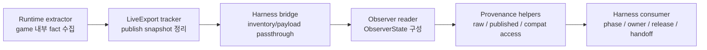
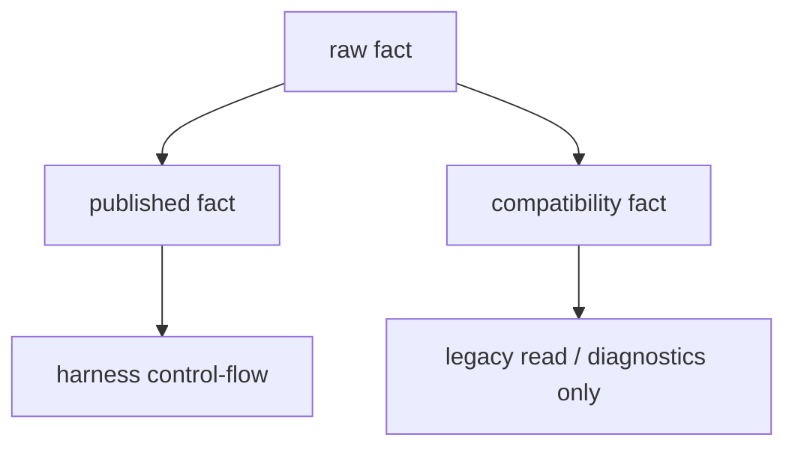
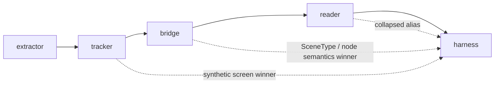
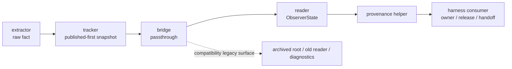

# GuiSmokeHarness Observer Stack Guide

> Status: Live Reference
> Source of truth: Yes, for current observer/export/bridge/reader layering and provenance rules
> Update when: observer fact/export contract, provenance helper priority, tracker/bridge responsibility, or harness observer-consumer rules change

## 0. 이 문서가 답하는 질문

이 문서는 `Sts2GuiSmokeHarness`와 관련된 문서 중에서도 **observer stack만 따로 떼어서** 설명하는 reference다.

즉 이 문서가 답해야 하는 질문은 아래다.

1. observer 개선 작업은 정확히 어느 층을 말하는가
2. extractor / tracker / bridge / reader / harness consumer는 각각 무엇을 소유하는가
3. `raw`, `published`, `compatibility`는 어디서 만들어지고 어디서 읽는가
4. 이번 리팩터링으로 무엇이 바뀌었고, 지금 무엇이 primary truth인가
5. 새 mixed-state 버그나 observer 이상 신호가 나오면 어느 층부터 봐야 하는가

핵심 한 줄:

```text
observer/export/bridge는 사실을 전달하고,
harness consumer만 owner / release / handoff를 결정한다.
```

## 1. 한눈에 보는 현재 구조



### 레이어별 한 줄 설명

| Layer | 역할 | 하면 안 되는 일 |
|---|---|---|
| extractor | 게임 내부에서 보이는 raw fact를 읽는다 | 최종 semantic winner를 고르지 않는다 |
| tracker | raw fact를 live export snapshot으로 정리한다 | `logicalScreen` 같은 synthetic field를 primary truth로 재승격하지 않는다 |
| bridge | snapshot을 harness inventory로 넘긴다 | `SceneType`이나 node semantics winner를 다시 고르지 않는다 |
| reader | snapshot/inventory를 읽어 `ObserverState`로 만든다 | published 값을 compat로 조용히 덮어쓰지 않는다 |
| provenance helper | `raw / published / compatibility`를 구분해서 읽게 한다 | broad alias로 provenance를 숨기지 않는다 |
| harness consumer | phase, owner, release, handoff, action lane를 결정한다 | tracker/bridge처럼 사실 전달자 역할을 다시 하지 않는다 |

## 2. 지금 무엇이 primary truth인가

현재 기준으로는 아래 순서가 맞다.

```text
primary control-flow:
  published -> direct/raw -> null

legacy / diagnostics:
  compatibility
```

즉 `compatibility`는 완전히 지운 것은 아니지만,

```text
"판단을 위해 기본으로 읽는 값"
```

이 아니라

```text
"옛 계약과 비교하거나 backward-read를 유지하기 위한 legacy surface"
```

로 남겨둔 상태다.

## 3. Provenance 용어를 observer 층에서 다시 풀면

| 용어 | 쉬운 뜻 | 예시 |
|---|---|---|
| `raw fact` | 게임 안에서 직접 읽은 가장 가까운 사실 | `rawCurrentScreen`, `activeScreenType`, `combatSelectedCardSlot` |
| `published fact` | 현재 export/bridge가 1차로 밖에 내보내는 값 | `publishedCurrentScreen`, `publishedVisibleScreen` |
| `compatibility fact` | 옛 계약과의 호환을 위해 남겨둔 legacy/fallback 값 | old `visibleScreen`, `sceneReady`, `sceneStability` 계열 |
| `compat shadow` | compat가 직접 주값은 아니지만 fallback으로 남아 판단에 영향을 주는 상태 | control-flow helper가 published가 비면 compat로 내려가는 경우 |

관계를 한 장으로 보면:



## 4. 리팩터링 전 / 후

### 4.1 이전에는 어땠나



문제는 이거였다.

| 문제 | 실제 의미 |
|---|---|
| tracker shaping | `logicalScreen`, `visibleScreen`, `sceneReady`가 사실상 winner처럼 동작 |
| bridge re-normalization | `SceneType`, node semantic hints가 다시 정규화됨 |
| reader collapse | top-level alias가 provenance를 숨김 |
| harness confusion | 최종 판단층이 “누가 이미 winner를 골랐는지”부터 추적해야 했음 |

### 4.2 지금은 어떻게 바뀌었나



핵심 변화는 아래다.

| 항목 | 이전 | 현재 |
|---|---|---|
| tracker | synthetic shaping이 강했음 | primary truth를 다시 덮어쓰지 않음 |
| bridge | scene/node winner를 다시 고름 | provenance passthrough 중심 |
| reader | collapsed alias가 provenance를 숨김 | raw/published/compat를 분리해 읽음 |
| harness consumer | old shaped field 영향이 큼 | published/direct 우선, compat는 legacy surface |

## 5. 레이어별 상세 설명

### 5.1 Extractor

주 파일:
- [RuntimeSnapshotReflectionExtractor.cs](/mnt/c/users/jidon/source/repos/sts2_mod_ai_companion/src/Sts2ModAiCompanion.Mod/Runtime/RuntimeSnapshotReflectionExtractor.cs)

역할:
- 게임 노드/매니저/런타임 필드에서 사실을 읽는다
- room/screen/combat/runtime card selection 같은 raw signal을 수집한다

예:
- `activeScreenType`
- `mapCurrentActiveScreen`
- `rewardForegroundOwned`
- `combatCardPlayPending`
- `combatSelectedCardSlot`

주의:
- extractor가 `지금 map이 winner다`, `이제 WaitMap으로 가라`를 정하면 안 된다

### 5.2 Tracker

주 파일:
- [LiveExportStateTracker.cs](/mnt/c/users/jidon/source/repos/sts2_mod_ai_companion/src/Sts2ModKit.Core/LiveExport/LiveExportStateTracker.cs)
- [LiveExportModels.cs](/mnt/c/users/jidon/source/repos/sts2_mod_ai_companion/src/Sts2ModKit.Core/LiveExport/LiveExportModels.cs)

역할:
- runtime poll / event를 모아 live export snapshot을 만든다
- published surface와 legacy compatibility meta를 함께 유지한다

현재 규칙:
- `publishedCurrentScreen`은 current export surface다
- `logicalScreen`, `visibleScreen`, `sceneReady`, `sceneAuthority`, `sceneStability`는 compatibility/meta 쪽이다

주의:
- tracker는 “conflicting fact가 둘 다 있으면 둘 다 남기기” 쪽이어야 한다
- one-winner collapse를 새로 만들면 안 된다

### 5.3 Bridge

주 파일:
- [InventoryPublisher.cs](/mnt/c/users/jidon/source/repos/sts2_mod_ai_companion/src/Sts2ModAiCompanion.HarnessBridge/InventoryPublisher.cs)
- [HarnessControlModels.cs](/mnt/c/users/jidon/source/repos/sts2_mod_ai_companion/src/Sts2ModKit.Core/Harness/HarnessControlModels.cs)

역할:
- tracker snapshot을 harness inventory/payload로 전달한다
- raw/published/compat provenance를 잃지 않게 싣는다

현재 규칙:
- bridge는 `SceneType` winner를 다시 정하는 층이 아니다
- node `kind`, `semanticHints`는 compat winner에 흔들리면 안 된다

주의:
- bridge가 “이 장면은 사실상 map이니까 node kind도 map으로 바꾸자” 같은 일을 하면 안 된다

### 5.4 Reader

주 파일:
- [ObserverSnapshotReader.cs](/mnt/c/users/jidon/source/repos/sts2_mod_ai_companion/src/Sts2GuiSmokeHarness/Observer/ObserverSnapshotReader.cs)
- [GuiSmokeObserverContracts.cs](/mnt/c/users/jidon/source/repos/sts2_mod_ai_companion/src/Sts2GuiSmokeHarness/GuiSmokeObserverContracts.cs)

역할:
- export/inventory를 읽어 `ObserverState`, `ObserverSummary`를 만든다
- top-level alias와 provenance surfaces를 함께 노출한다

현재 규칙:
- published provenance를 legacy meta로 다시 채우지 않는다
- compatibility는 별도 surface로만 남긴다

주의:
- reader가 `publishedVisibleScreen`을 compat `meta.visibleScreen`으로 다시 살려내면 안 된다

### 5.5 Provenance Helper

주 파일:
- [ObserverScreenProvenance.cs](/mnt/c/users/jidon/source/repos/sts2_mod_ai_companion/src/Sts2GuiSmokeHarness/Observer/ObserverScreenProvenance.cs)

역할:
- consumer가 `CurrentScreen`을 그냥 보지 말고
- `PublishedCurrentScreen`, `DirectCurrentScreen`, `CompatibilityCurrentScreen` 같은 helper로 의식적으로 읽게 한다

현재 규칙:
- control-flow는 published/direct 우선
- compatibility는 legacy/read-only

### 5.6 Harness Consumer

주 파일:
- [ObserverAcceptanceEvaluator.cs](/mnt/c/users/jidon/source/repos/sts2_mod_ai_companion/src/Sts2GuiSmokeHarness/Observer/ObserverAcceptanceEvaluator.cs)
- [GuiSmokeSceneReasoningSupport.cs](/mnt/c/users/jidon/source/repos/sts2_mod_ai_companion/src/Sts2GuiSmokeHarness/GuiSmokeSceneReasoningSupport.cs)
- [Program.PhaseLoopRouting.cs](/mnt/c/users/jidon/source/repos/sts2_mod_ai_companion/src/Sts2GuiSmokeHarness/Program.PhaseLoopRouting.cs)
- [Program.AllowedActions.NonCombat.cs](/mnt/c/users/jidon/source/repos/sts2_mod_ai_companion/src/Sts2GuiSmokeHarness/Program.AllowedActions.NonCombat.cs)
- [Program.AllowedActions.Combat.cs](/mnt/c/users/jidon/source/repos/sts2_mod_ai_companion/src/Sts2GuiSmokeHarness/Program.AllowedActions.Combat.cs)

역할:
- 여기서만 최종 semantic 판단을 한다
- phase acceptance, owner, release, handoff, allowlist, decision lane을 결정한다

핵심 규칙:

```text
observer/export/bridge = fact transport
harness consumer        = semantic decision
```

## 6. 실제 mixed-state 예시

### reward aftermath -> map

예전:
- reward teardown 중인데 map도 보이면
- tracker/bridge/reader/harness 중 여러 층이 제각각 winner를 고를 수 있었다

지금:
- raw fact:
  - `rewardTeardownInProgress=true`
  - `mapCurrentActiveScreen=true`
- published fact:
  - export가 현재 표면으로 내는 값
- harness:
  - 여기서 canonical owner를 `Map`으로 결정

즉:

```text
fact는 여러 개가 같이 있을 수 있다
winner는 harness만 고른다
```

### combat 중 map 잔상

전투 중에도 raw/published/compat가 다를 수 있다.

예:
- runtime fact는 `combat`
- published는 아직 `map`
- compatibility는 또 다른 값을 가리킬 수 있다

이때 해야 할 일:
1. extractor가 뭘 읽었는지 본다
2. tracker가 published를 어떻게 만들었는지 본다
3. bridge가 바꾸지 않았는지 본다
4. reader/helper가 control-flow에서 어떤 표면을 읽었는지 본다

즉 observer bug는 이제 “하네스가 이상함”이 아니라, **어느 provenance 층이 어긋났는지**로 좁혀서 볼 수 있다.

## 7. 이상 신호가 나오면 어디부터 볼까

| 증상 | 먼저 볼 곳 | 왜 |
|---|---|---|
| top-level screen이 이상함 | `ObserverSnapshotReader`, `ObserverScreenProvenance` | reader/helper collapse 문제일 수 있음 |
| published가 raw와 다름 | `LiveExportStateTracker` | tracker shaping 또는 publish rule 문제일 수 있음 |
| node kind/hints가 이상함 | `InventoryPublisher` | bridge가 semantic winner를 다시 고를 수 있음 |
| runtime에는 분명한데 harness가 못 봄 | extractor meta + reader provenance helper | raw fact가 reader에서 사라졌을 수 있음 |
| mixed-state에서 room handoff가 이상함 | harness consumer | fact는 정상인데 owner/release/handoff 판단이 틀렸을 수 있음 |

## 8. 현재 기준 체크리스트

observer 개선 결과를 빠르게 확인하려면 아래를 보면 된다.

| 확인 질문 | 보면 되는 것 |
|---|---|
| observer 개선이 실제로 뭘 바꿨나 | [GUI_SMOKE_HARNESS_REFACTOR_BEFORE_AFTER.md](/mnt/c/users/jidon/source/repos/sts2_mod_ai_companion/docs/reference/harness/GUI_SMOKE_HARNESS_REFACTOR_BEFORE_AFTER.md) `옵저버 / bridge / provenance 전/후` |
| 지금 observer stack이 어떤 구조인가 | 이 문서 |
| 현재 repo가 observer를 어떤 원칙으로 유지하나 | [GUI_SMOKE_HARNESS_MODULE_BOUNDARIES.md](/mnt/c/users/jidon/source/repos/sts2_mod_ai_companion/docs/contracts/GUI_SMOKE_HARNESS_MODULE_BOUNDARIES.md) |
| 용어가 헷갈린다 | [GUI_SMOKE_HARNESS_GLOSSARY_KO.md](/mnt/c/users/jidon/source/repos/sts2_mod_ai_companion/docs/reference/harness/GUI_SMOKE_HARNESS_GLOSSARY_KO.md) |
| current main에서 observer provenance migration이 완료됐는가 | [PROJECT_STATUS.md](/mnt/c/users/jidon/source/repos/sts2_mod_ai_companion/docs/current/PROJECT_STATUS.md) |

## 9. 추천 읽기 순서

observer 관련만 이해하려면 이 순서가 가장 쉽다.

1. 이 문서
2. [GUI_SMOKE_HARNESS_GLOSSARY_KO.md](/mnt/c/users/jidon/source/repos/sts2_mod_ai_companion/docs/reference/harness/GUI_SMOKE_HARNESS_GLOSSARY_KO.md)
3. [GUI_SMOKE_HARNESS_REFACTOR_BEFORE_AFTER.md](/mnt/c/users/jidon/source/repos/sts2_mod_ai_companion/docs/reference/harness/GUI_SMOKE_HARNESS_REFACTOR_BEFORE_AFTER.md)
4. [GUI_SMOKE_HARNESS_ARCHITECTURE.md](/mnt/c/users/jidon/source/repos/sts2_mod_ai_companion/docs/reference/harness/GUI_SMOKE_HARNESS_ARCHITECTURE.md)
5. [GUI_SMOKE_HARNESS_MODULE_BOUNDARIES.md](/mnt/c/users/jidon/source/repos/sts2_mod_ai_companion/docs/contracts/GUI_SMOKE_HARNESS_MODULE_BOUNDARIES.md)
