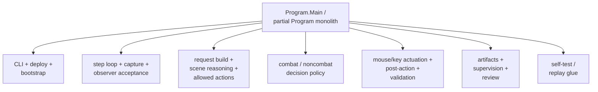
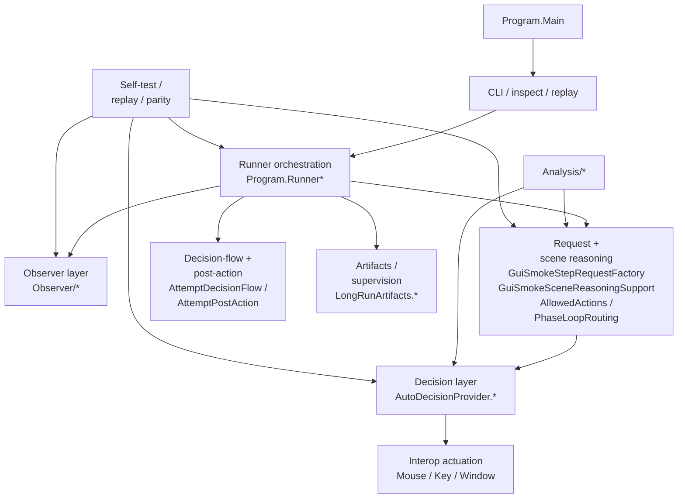
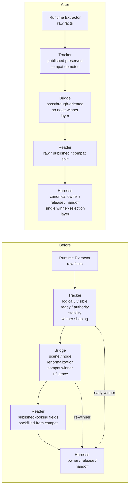
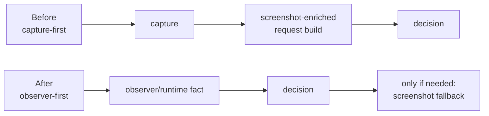

# GuiSmokeHarness 리팩터링 전/후 비교

이 문서는 최근 GuiSmokeHarness 리팩터링과 cleanup 작업의 핵심 성과를 "전/후 비교" 관점에서 요약합니다.

목표는 세 가지입니다.

1. 사람이 빠르게 읽어도 전체 변화가 한눈에 들어오게 하기
2. `하네스 구조`, `옵저버/bridge/provenance`, `속도/검증`을 분리해서 이해하기
3. 내부 용어를 함께 설명해서 새 세션이나 새 작업자가 바로 따라올 수 있게 하기

관련 문서:

- 현재 구조 기준선: [GUI_SMOKE_HARNESS_ARCHITECTURE.md](./GUI_SMOKE_HARNESS_ARCHITECTURE.md)
- 용어집: [GUI_SMOKE_HARNESS_GLOSSARY_KO.md](./GUI_SMOKE_HARNESS_GLOSSARY_KO.md)
- current status: [../../current/PROJECT_STATUS.md](../../current/PROJECT_STATUS.md)
- cleanup 완료 기준 계약: [../../contracts/GUI_SMOKE_HARNESS_MODULE_BOUNDARIES.md](../../contracts/GUI_SMOKE_HARNESS_MODULE_BOUNDARIES.md)

## 한눈에 보는 결론

| 축 | 리팩터링 전 | 리팩터링 후 | 핵심 효과 |
|---|---|---|---|
| 하네스 구조 | `partial Program` 중심의 사실상 monolith | runner / observer / request / decisions / artifacts owner 분리 | 어디가 owner인지 파일 단위로 보임 |
| mixed-state 처리 | reward/map, event/map 같은 family마다 local guard와 case-by-case residue 누적 | canonical `owner / release / handoff` 중심 | mixed-state 재발 가능성 감소 |
| 옵저버 provenance | raw/published/compatibility가 섞이고 tracker/bridge가 winner를 일부 선행 결정 | raw / published / compatibility 분리, winner는 harness만 결정 | 디버깅과 root-cause 추적 쉬워짐 |
| bridge 역할 | scene/node semantics를 다시 고르는 재정규화 층 | provenance passthrough 중심 | node semantics 오염 감소 |
| 속도 | `capture-first`, screenshot-enriched request build가 기본 | `observer-first`, screenshot-on-demand | common lane latency 대폭 감소 |
| 검증/운영 | monolith 전제 해석 + stale deploy 혼선 위험 | work-unit 단위 검증/문서/current baseline 정착 | 운영 실수와 오판 감소 |

## 시스템 그림: 전 / 후

### Before

### After

## 1. 하네스 구조 전/후

### 무엇이 바뀌었나

| 항목 | 리팩터링 전 | 리팩터링 후 |
|---|---|---|
| 진입점 | `Program.cs`와 여러 `partial Program`이 CLI, deploy, runner, observer, decisions를 같이 보유 | `Program.cs`는 shell-only, 실제 owner는 각 전용 모듈 |
| step loop | capture, observer acceptance, request build, decision, actuation, post-action이 한 덩어리 | runner band가 단계별 seam으로 분리 |
| scene reasoning | `Program` helper들에 넓게 퍼져 있음 | `GuiSmokeStepRequestFactory`, `GuiSmokeSceneReasoningSupport`, `AllowedActions`, `PhaseLoopRouting`로 정리 |
| decisions | mixed-state와 subtype residue가 한 파일에 겹침 | `AutoDecisionProvider.*`에서 combat/noncombat/scene-state/room-lane으로 분리 |
| artifacts / supervision | run summary, startup, plateau, review evidence가 `Program`과 혼재 | `LongRunArtifacts.*`와 supervision band로 분리 |

### 모듈 owner 전후 비교

| 기능 | 리팩터링 전 대표 owner | 리팩터링 후 대표 owner |
|---|---|---|
| shell / CLI | `Program.cs`, `partial Program` | `Program.cs`, `Program.Cli.cs`, `Program.InspectAndReplay.cs` |
| runner orchestration | `Program` monolith | `Program.Runner.cs`, `Program.Runner.AttemptLoop.cs`, `Program.Runner.AttemptStepExecution.cs`, `Program.Runner.AttemptPostAction.cs` |
| observer / acceptance | `Program` helper + reader 혼재 | `Observer/ObserverSnapshotReader.cs`, `Observer/ObserverAcceptanceEvaluator.cs`, `Observer/NonCombatForegroundOwnership.cs` |
| request / scene reasoning | `Program.StepRequests.cs`, `Program.SceneReasoning.cs` 중심 | `GuiSmokeStepRequestFactory.cs`, `GuiSmokeSceneReasoningSupport.cs`, `Program.AllowedActions.*`, `Program.PhaseLoopRouting.cs` |
| decisions | 큰 `AutoDecisionProvider` 파일 몇 개 | `AutoDecisionProvider.Core.cs`, `AutoDecisionProvider.NonCombatSceneState.cs`, `AutoDecisionProvider.NonCombatRoomLaneDecisions.cs`, `AutoDecisionProvider.CombatDecisions.cs` |
| analysis | scattered helper | `Analysis/*` band |
| artifacts / supervision | `Program` + `LongRunArtifacts` 혼재 | `LongRunArtifacts.*`, `LongRunArtifacts.SupervisionHealth.cs` |

### 실질 성과

| 성과 | 의미 |
|---|---|
| `Program.cs`가 semantic owner가 아님 | 새 버그가 나와도 `Program.cs`부터 뒤질 필요가 크게 줄어듦 |
| runner seam 분리 | preflight / decision-flow / post-action / bounded failure를 다른 층과 구분해서 볼 수 있음 |
| room-lane 분리 | reward / event / treasure / rest / map overlay 같은 explicit lane 디버깅이 쉬워짐 |
| supervision band 분리 | plateau, process-lost, startup evidence를 gameplay semantics와 분리해서 볼 수 있음 |

## 2. 옵저버 / bridge / provenance 전/후

### 핵심 질문

리팩터링 전 가장 큰 문제는 "누가 winner를 정하느냐"가 여러 층에 퍼져 있었다는 점입니다.

- extractor가 raw fact를 읽음
- tracker가 `logicalScreen`, `visibleScreen`, `sceneReady`를 만들며 early shaping
- bridge가 scene/node semantics를 다시 정규화
- reader가 published처럼 보이는 값을 legacy compatibility meta에서 다시 채움
- harness가 그 위에서 owner/release/handoff를 또 계산

즉 `winner-selection`이 한 층이 아니라 여러 층에 흩어져 있었습니다.

### Observer flow: 전 / 후

### provenance 전후 비교

| 항목 | 리팩터링 전 | 리팩터링 후 |
|---|---|---|
| raw fact | extractor가 읽지만 downstream에서 의미가 섞임 | raw fact는 additive truth로 유지 |
| published fact | reader가 legacy meta에서 다시 채우는 경우가 있었음 | published는 published만 읽음 |
| compatibility fact | legacy fallback이 primary처럼 쓰이는 경우가 있었음 | compatibility는 fallback/legacy 층으로 강등 |
| tracker | `logicalScreen`, `visibleScreen`, `sceneReady` 등 synthetic shaping이 강했음 | shaping은 compatibility meta로 demote |
| bridge | scene type winner와 node semantics를 다시 정함 | provenance passthrough 중심 |
| harness consumer | collapsed alias만 보고 분기하는 경로가 많았음 | raw/published/compat를 순서 있게 읽는 dual-read 경로로 이동 |

### 실질 성과

| 성과 | 의미 |
|---|---|
| published provenance 오염 제거 | `publishedVisibleScreen` 같은 값이 legacy meta에서 다시 태어나지 않음 |
| bridge node-semantics winner 제거 | node `Kind`와 `SemanticHints`가 compatibility winner에 흔들리지 않음 |
| winner-selection 단일화 | `owner / release / handoff`는 harness만 계산 |
| mixed-state root-cause 추적 개선 | reward/map 같은 family에서 raw/published/compat를 따로 볼 수 있음 |

## 3. mixed-state와 semantic stability 전/후

### 이전 문제 패턴

| family | 리팩터링 전 패턴 |
|---|---|
| reward aftermath -> map | reward/map mixed state에서 foreground owner와 final map-node decision이 서로 다른 층에서 엇갈림 |
| WaitRunLoad resumed room | load 이후 resumed room을 어디서 받을지 acceptance와 routing이 분산됨 |
| EndTurn barrier | actuation 이전 drift와 barrier arm이 같은 hot path에서 얽혀 false-arm 가능 |
| WaitMainMenu -> EnterRun | main-menu ready와 run-start surface ready를 같은 것으로 취급 |

### 현재 상태

| family | 현재 상태 |
|---|---|
| reward aftermath -> map exported node | live + parity green |
| WaitRunLoad resumed room handoff | canonical routing으로 안정 |
| EndTurn pre-actuation drift / false barrier arm | 닫힘 |
| WaitMainMenu -> EnterRun premature acceptance | 닫힘 |

### 핵심 설계 변화

| 설계 축 | 이전 | 현재 |
|---|---|---|
| foreground owner | local guard와 local scene wrapper가 섞여 결정 | canonical owner contract 중심 |
| release stage | owner와 분리되지 않은 guard 누적 | `release`를 독립 축으로 사용 |
| handoff target | phase routing 곳곳에 partial heuristic | owner/release 기반 handoff contract |
| node/candidate materialization | mixed-state residue와 함께 섞임 | room-lane decision band에서 더 명확히 처리 |

## 4. 속도 전/후

### 핵심 변화

리팩터링 전의 느림은 주로 `decision`이 아니라 다음 앞단/뒷단에서 왔습니다.

1. 매 step 선행 capture
2. screenshot-enriched request build
3. hot polling 중 `events.ndjson` tail 재스캔
4. observer-only로 충분한 lane에서도 blind wait와 compatibility heavy path 사용

현재는 기본 경로가 다음으로 바뀌었습니다.

### representative 속도 비교

아래 값은 동일 family의 representative lane 비교입니다.

| metric | before | after | effect |
|---|---:|---:|---|
| combat actionable `preflight->request` | 약 `5.3s` | 약 `15.5ms` | 약 `99.7%` 감소 |
| combat actionable total step time | 약 `8.2s` | 약 `224ms` | 약 `97.3%` 감소 |
| menu / observer-only polling | 약 `1.28s` | 약 `9.6ms` | 약 `99%` 감소 |

### 왜 빨라졌나

| 변경 | 효과 |
|---|---|
| `capture-first -> observer-first` | 기본 step에서 capture를 선행 조건으로 쓰지 않음 |
| screenshot-on-demand | visual fallback이 필요한 family에서만 capture |
| hot polling tail cache | `events.ndjson` tail 재스캔 비용 감소 |
| explicit room/combat lane observer-only화 | common lane에서 screenshot analyzer 비용 제거 |
| WaitMainMenu readiness 분리 | logo-animation 같은 transient screen을 조기 accept하지 않음 |

### 중요한 안전성 포인트

이 속도 향상은 "wait를 무턱대고 깎은 것"이 아닙니다.

| 안전장치 | 설명 |
|---|---|
| screenshot fallback 유지 | visual ambiguity lane에서는 여전히 screenshot 분석 사용 |
| acceptance gate 유지 | 명확한 observer truth가 없으면 phase를 넘기지 않음 |
| barrier / no-op / bounded failure 유지 | actuation 후 stability/ack 검증은 유지 |
| deploy/validation guardrails 유지 | stale deploy와 runtime mismatch를 invalid test condition으로 계속 취급 |

## 5. 검증 / 운영 전후

### 리팩터링 전

| 항목 | 특징 |
|---|---|
| 배포/검증 | stale deploy와 runtime mismatch가 gameplay 이슈처럼 섞여 보일 위험이 큼 |
| current docs | monolith/cleanup 중간 단계가 남아 있는 문서가 섞임 |
| live proof | partial root와 authoritative root 구분이 약한 시기가 있었음 |

### 현재

| 항목 | 특징 |
|---|---|
| work unit cadence | `build -> shared self-test -> harness self-test -> replay-test -> replay-parity-test -> fresh live` 고정 |
| deploy guardrails | game/crashpad 종료, mods payload reconcile, deployed identity 확인 후 검증 |
| current docs | latest proof root와 coverage frontier가 current baseline으로 정리 |
| partial proof handling | process interference나 invalid deploy root는 authoritative blocker로 보지 않음 |

## 6. 무엇이 쉬워졌나

| 작업 | 전 | 후 |
|---|---|---|
| mixed-state 디버깅 | tracker/bridge/harness 중 누가 winner를 골랐는지부터 추적해야 함 | raw/published/compat와 canonical owner를 순서대로 보면 됨 |
| 새 edge case 수정 | local guard를 또 쌓기 쉬움 | room-lane/owner/release contract 기준으로 좁게 수정 가능 |
| 속도 문제 분석 | capture/decision/wait 비용이 한 데 섞여 보임 | `preflight->request`, `request->decision`, `decision->after`로 분리 |
| 문서/세션 handoff | 이전 refactor 단계 설명이 오래 남을 수 있음 | current baseline과 cleanup-complete contract로 정리 |

## 7. 아직 남은 것

리팩터링/cleanup 자체는 완료 상태입니다. 남은 것은 구조개편이 아니라 coverage frontier입니다.

| 남은 일 | 의미 |
|---|---|
| `capture-boundary` proof 보강 | bounded failure / reopen coverage |
| `strict lifecycle chain` proof 보강 | terminal -> restart -> next-attempt continuity evidence |
| 일부 partial row 보강 | target lane, enemy-turn closed play-phase, reward back 등 |

즉 현재 상태는 "리팩터링 중"이 아니라 "cleanup-complete baseline + coverage maintenance"입니다.

## 용어 설명

| 용어 | 설명 |
|---|---|
| raw fact | runtime extractor가 읽은 가장 직접적인 관찰 사실 |
| published fact | tracker/bridge를 거쳐 외부에 publish된 현재 기준 사실 |
| compatibility fact | 과거 계약과의 호환을 위해 남겨둔 legacy 또는 fallback 값 |
| tracker | runtime 관찰을 live export 모델로 정리하는 층 |
| bridge | live export를 harness inventory/payload로 전달하는 층 |
| reader | harness 쪽에서 observer snapshot/inventory를 읽어 `ObserverState`로 만드는 층 |
| winner-selection | 여러 conflicting fact 중 "지금 누구 차례인가"를 최종 결정하는 행위 |
| canonical owner | harness가 최종적으로 계산한 foreground owner. 예: `Reward`, `Event`, `Shop`, `Map` |
| release | foreground owner가 내려가거나 aftermath로 이동하는 단계 |
| handoff | 현재 phase에서 다음 phase로 넘기는 결정. 예: `HandleRewards`, `WaitMap`, `ChooseFirstNode` |
| room-lane | reward/event/shop/rest/treasure/map overlay처럼 room/scene family별 explicit decision lane |
| screenshot fallback | observer/runtime fact만으로 결론이 안 날 때만 사용하는 visual 분석 경로 |
| observer-first | capture보다 observer/runtime fact를 우선 사용한다는 정책 |
| capture-boundary | capture 실패/불가 상태를 bounded failure/diagnostic로 다루는 coverage family |

## 추천 읽기 순서

1. 이 문서에서 전/후 그림과 표를 먼저 본다
2. [GUI_SMOKE_HARNESS_ARCHITECTURE.md](./GUI_SMOKE_HARNESS_ARCHITECTURE.md)에서 현재 구조를 본다
3. [PROJECT_STATUS.md](../../current/PROJECT_STATUS.md)에서 최신 proof root와 coverage frontier를 확인한다
4. [GUI_SMOKE_HARNESS_MODULE_BOUNDARIES.md](../../contracts/GUI_SMOKE_HARNESS_MODULE_BOUNDARIES.md)에서 cleanup-complete baseline contract를 본다
