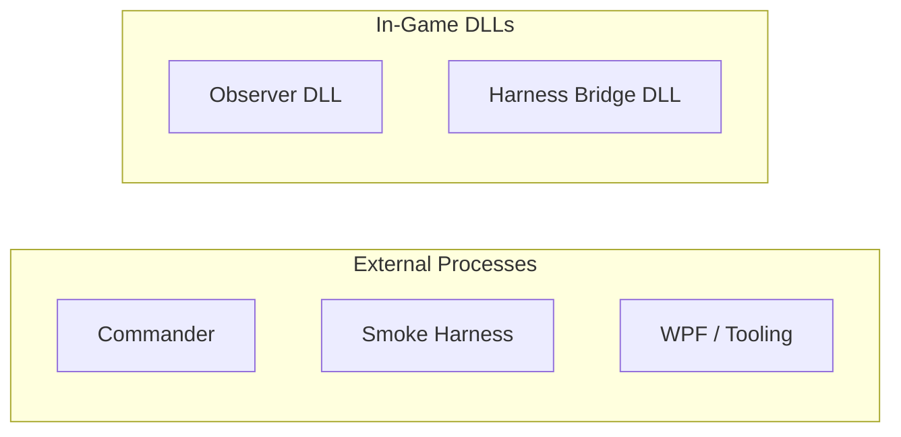
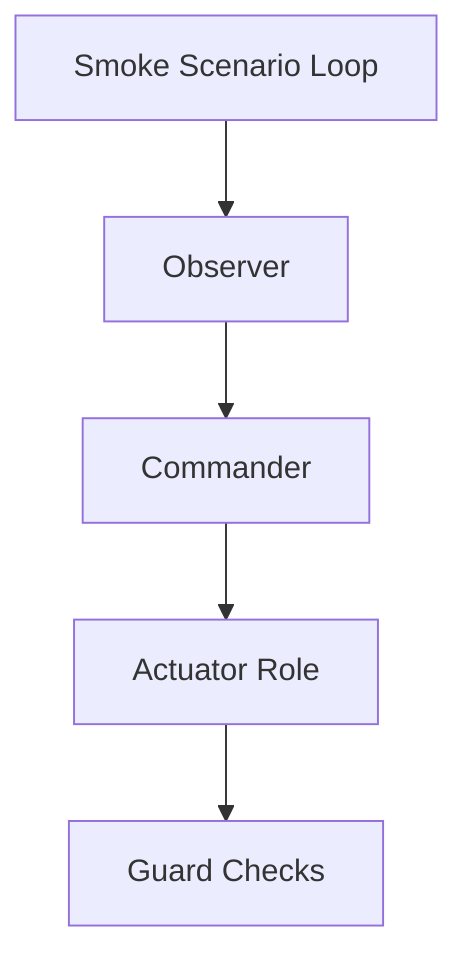
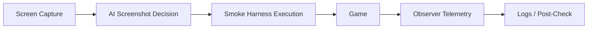

# Harness Layer Architecture

> Status: Reference
> Source of truth: No
> Use this for harness boundary background, not for current-state or milestone decisions.

## 목적
이 문서는 현재 프로젝트의 물리 배포 단위와 논리 역할을 분리해서 설명한다.
가장 중요한 기준은 다음과 같다.

1. 최종 제품 구조의 중심은 `Observer / Actuator / Commander` 이다.
2. `GUI Smoke Harness`는 제품의 일부가 아니라 개발용 black-box 테스트 도구다.
3. `Smoke Harness`는 `screenshot-first`로 동작해야 한다.
4. `Observer`는 smoke harness의 행동을 지시하지 않고, telemetry와 post-check를 담당한다.

## 물리 단위와 실행 위치

## 논리 역할

## 핵심 해석
- `Observer`는 게임 내부 truth와 상태를 export 한다.
- `Actuator Role`은 현재 별도 DLL이 아니라 `Harness Bridge DLL` 내부 역할이다.
- `Commander`는 게임 외부 프로세스다.
- `Smoke Scenario Loop`는 `Smoke Harness` 내부 상태 머신이며, 사람이 하던 테스트 플레이를 대신 수행한다.
- `Guard Checks`는 명령 검증과 안전 조건 확인을 담당한다.

## DLL 이름과 역할 매핑

| 물리 DLL / 프로세스 | 현재 이름 | 역할 |
|---|---|---|
| 인게임 DLL | `Sts2ModAiCompanion.Mod.dll` | Observer / runtime export / hook / polling |
| 인게임 DLL | `Sts2ModAiCompanion.HarnessBridge.dll` | Harness bridge / guard / actuator role |
| 외부 프로세스 | `Sts2GuiSmokeHarness` | 개발용 screenshot-first black-box tester |
| 외부 프로세스 | commander 계열 프로세스 | observer를 읽고 명령을 생성하는 최종 AI 의사결정자 |

## 중요한 용어 정리

### Smoke Harness
- 개발용 GUI 테스트 도구 전체를 뜻한다.
- 사람 대신 게임을 플레이하면서 observer 검증용 런타임 증거를 만든다.

### Smoke Scenario Loop
- `Smoke Harness` 내부의 단계 진행 상태 머신이다.
- 별도 제품 레이어가 아니다.

### Harness Bridge
- 게임 내부 DLL 쪽 bridge / guard / actuator 역할 묶음이다.
- 문서상 예전 `Command Bridge`라는 표현보다 이 용어를 우선한다.

### Observer
- action authority가 아니다.
- internal truth, telemetry, export contract를 담당한다.

## 현재 운영 원칙

해석:
- 행동 결정은 `스크린샷 -> AI 판단`에서 나온다.
- 실행은 `Smoke Harness`가 담당한다.
- `Observer`는 그 결과를 기록한다.
- 이후 로그 분석을 통해 observer를 계속 강화한다.

## 현재 구조에서 중요한 현실
1. `Smoke Harness`의 1차 목적은 observer를 대신하는 것이 아니라, observer 검증용 실제 플레이 로그를 생성하는 것이다.
2. `Observer`가 틀려도 smoke harness는 계속 진행할 수 있어야 한다.
3. 따라서 smoke harness가 observer stale state에 끌려다니면 구조가 잘못된 것이다.
4. 지금 기준으로 가장 중요한 개선 목표는 `screenshot-first smoke harness` 완성이다.
